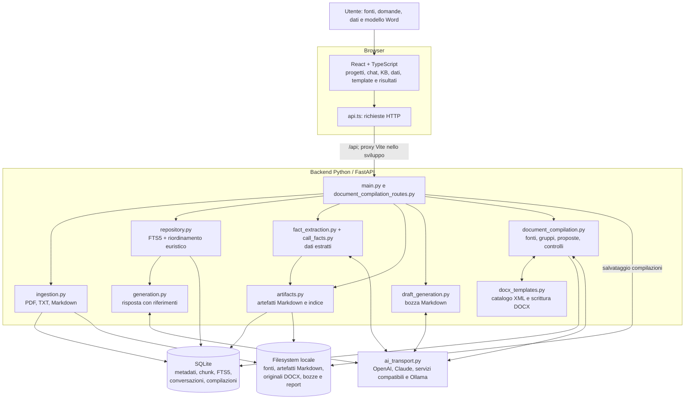
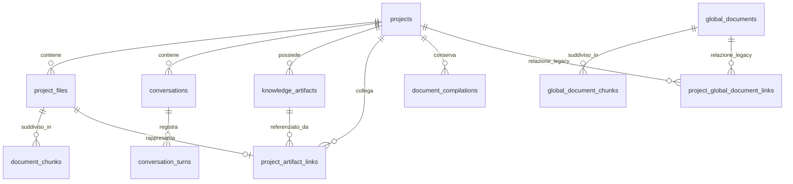
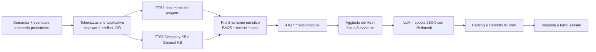
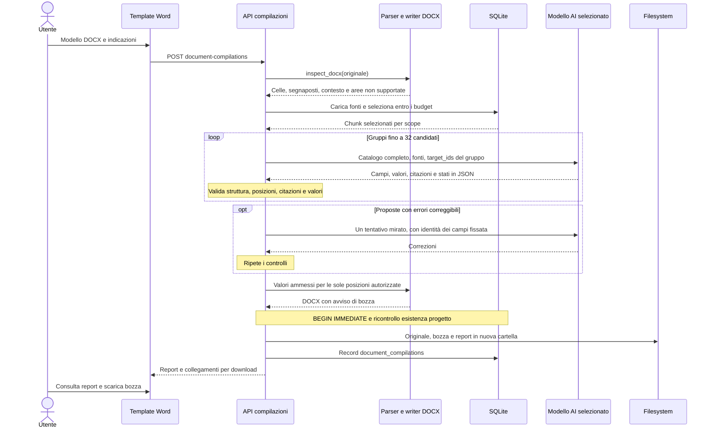
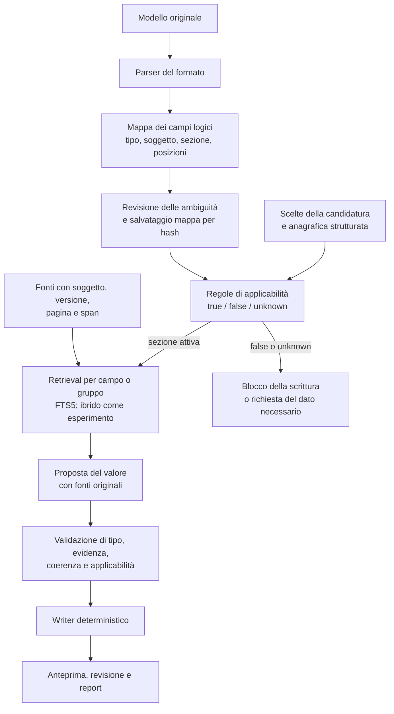

# Architettura e valutazione di Mapi RAG


## 1. Valutazione complessiva

**L'impostazione è sensata per una tesi e per un prototipo di compilazione assistita.**
SQLite/FTS5, FastAPI, un writer Word deterministico e proposte LLM validate sono
una base comprensibile e sperimentabile. Non occorre sostituire tutto con un
framework RAG o con un database vettoriale per rendere valido il progetto.

Il problema centrale è più ampio di «trovare i campi vuoti»: occorre determinare
**significato del campo, soggetto a cui appartiene, applicabilità della sezione,
evidenza pertinente e posizione di scrittura**. Queste decisioni oggi sono in
gran parte affidate alla stessa risposta del modello. Una citazione autentica
può accompagnare un dato inserito nel campo sbagliato.

Un'altra distinzione fondamentale per la tesi: **la chat usa retrieval FTS5;
la compilazione DOCX attuale seleziona fonti entro budget, senza retrieval
mirato per campo**. Migliorare il retrieval della chat non migliora automaticamente
il compilatore, perché sono percorsi differenti.

L'oggetto compilato è il **modello di domanda/allegato al bando**. Il bando e il
disciplinare sono invece fonti di istruzioni e requisiti. Il risultato attuale è
una bozza parziale con report, senza firma o presentazione della candidatura.

## 2. Architettura implementata



È un **monolite modulare**: un frontend e un backend, con funzioni Python per
orchestrare le diverse pipeline. Non sono presenti embedding, ricerca vettoriale,
reranker neurali, una coda di lavori o un agente che scelga autonomamente strumenti.

Le fonti sono conservate localmente, ma i testi selezionati vengono inviati al
servizio scelto durante la generazione. Con DeepSeek l'inferenza è remota;
con Ollama avviene sul computer che ospita quel servizio.

Le impostazioni generali permettono di salvare più configurazioni AI. Ogni
progetto può seguire il predefinito o scegliere un profilo specifico; la scelta
vale per tutte le sue funzioni AI. `ai_routes.py` espone la configurazione,
`ai_profiles.py` salva i profili e cifra le chiavi, `config.py` mantiene la
selezione per tutta la richiesta e `ai_transport.py` adatta il protocollo.
`ai_providers.py` definisce i servizi e i relativi indirizzi;
`ai_discovery.py` legge gli elenchi dei modelli. OpenAI usa Responses, Claude
usa Messages, Ollama la propria API; Gemini, DeepSeek, Mistral, Grok, Groq e
OpenRouter usano Chat Completions. `ai_login.py` gestisce l'accesso OpenRouter
con PKCE e codice monouso. Gli altri servizi cloud richiedono una chiave API.
Non vengono cambiati i contratti di generazione o i controlli sui documenti.
Schema e dettagli: [Modelli AI](backend/docs/modelli-ai.md).

### Componenti e responsabilità

| Componente                 | File principali                                                                                    | Responsabilità effettiva                                                            |
| -------------------------- | -------------------------------------------------------------------------------------------------- | ----------------------------------------------------------------------------------- |
| Navigazione e pagine       | [App.tsx](frontend/src/App.tsx), [pages](frontend/src/pages/)                                      | Progetti, conversazioni, KB, preparazione e viste dimostrative.                     |
| Client HTTP                | [api.ts](frontend/src/api.ts), [types.ts](frontend/src/types.ts)                                   | Richieste, errori e tipi del frontend.                                              |
| Compilazione Word nella UI | [DocxTemplateWorkspace.tsx](frontend/src/components/DocxTemplateWorkspace.tsx)                     | File e istruzioni, generazione, storico, report, download e riutilizzo del modello. |
| Dati della candidatura     | [ProjectFactsWorkspace.tsx](frontend/src/components/ProjectFactsWorkspace.tsx)                     | Dati estratti correggibili/escludibili e dati inseriti dall'utente.                 |
| API principali             | [main.py](backend/app/main.py)                                                                     | CRUD, caricamenti, chat, estrazione e generazione Markdown.                         |
| Persistenza                | [db.py](backend/app/db.py), [repository.py](backend/app/repository.py)                             | Schema SQLite, trigger FTS5, query e aggiornamenti.                                 |
| Ingestion                  | [ingestion.py](backend/app/ingestion.py)                                                           | Estrazione del testo e suddivisione in chunk.                                       |
| Artefatti e fatti          | [artifacts.py](backend/app/artifacts.py), [call_facts.py](backend/app/call_facts.py)               | Markdown, versioni, collegamenti e disponibilità dei fatti.                         |
| Estrazione LLM             | [fact_extraction.py](backend/app/fact_extraction.py)                                               | Sintesi dei documenti del progetto con riferimenti ai frammenti.                    |
| Chat e draft testuale      | [generation.py](backend/app/generation.py), [draft_generation.py](backend/app/draft_generation.py) | Due contratti di generazione distinti.                                              |
| Compilatore                | [document_compilation.py](backend/app/document_compilation.py)                                     | Contesto, proposte JSON, validazione, gruppi e correzione limitata.                 |
| Parser/writer Word         | [docx_templates.py](backend/app/docx_templates.py)                                                 | Controllo ZIP/XML, candidati, coordinate fisiche e sostituzioni.                    |
| API DOCX                   | [document_compilation_routes.py](backend/app/document_compilation_routes.py)                       | Upload, persistenza dei risultati e download per progetto.                          |

Le dipendenze dichiarate sono in [pyproject.toml](backend/pyproject.toml) e
[package.json](frontend/package.json): Python >= 3.14, FastAPI, SQLite della
libreria standard, pypdf, python-docx, httpx, Pydantic e React 19/TypeScript/Vite.
Il writer usa anche `lxml`, presente attraverso le dipendenze di python-docx.
Modello, URL ed eventuale chiave si configurano dall'interfaccia e vengono
salvati in SQLite. La configurazione DeepSeek preesistente viene importata
all'avvio. Per i nuovi profili il modello viene scelto dall'elenco del servizio
o inserito manualmente: non c'è un catalogo statico dei nomi nel frontend.

## 3. Dati, archivi e isolamento



Schema semplificato: le tabelle virtuali FTS5 e le tabelle di presentazione/seed
non sono riprodotte nell'ER. I trigger sincronizzano i due indici con le tabelle
dei chunk. All'avvio vengono inizializzati DB, dati dimostrativi e artefatti;
gli artefatti vengono anche riallineati all'indice.

| Archivio                                      | Contenuto e uso                                                                                                                                   |
| --------------------------------------------- | ------------------------------------------------------------------------------------------------------------------------------------------------- |
| `project_files` / `document_chunks`           | Fonti specifiche del progetto e rappresentazione indicizzata di alcuni artefatti.                                                                 |
| `global_documents` / `global_document_chunks` | Company KB e General KB, distinte dalla colonna `category`, condivise fra i progetti.                                                             |
| `knowledge_artifacts`                         | `call-facts.md`, `project-facts.md`, `template.md`, `draft.md`; metadati, hash e contatore di versione.                                           |
| `conversation_turns`                          | Domanda, risposta, riferimenti, estratti delle evidenze, modello e consumo dichiarato. Non conserva tutto il prompt.                              |
| `document_compilations`                       | Una riga per esecuzione riuscita, report JSON e percorso dei file. I campi compilati sono nel report, non nella tabella legacy `document_fields`. |

Percorsi predefiniti, modificabili con variabili d'ambiente:

```text
backend/data/
├── mapi.db                              MAPI_DB_PATH
├── knowledge/                          MAPI_KNOWLEDGE_PATH
│   └── ... artefatti Markdown
└── uploads/                            MAPI_STORAGE_PATH
    ├── _global/company/                fonti aziendali
    ├── _global/general/                fonti tecniche generali
    └── <project_id>/
        ├── ... fonti caricate
        └── _compilations/<run_id>/
            ├── template.docx
            ├── bozza.docx
            └── report.json
```

L'isolamento dei documenti di progetto è basato su `project_id`. Le KB globali
sono intenzionalmente disponibili a tutti i progetti: le query di retrieval e
compilazione non le filtrano tramite `project_global_document_links`.
L'endpoint legacy di collegamento restituisce attualmente i documenti come
collegati e non applica il flag `linked` come selezione effettiva.
È coerente con una sola azienda, ma non implementa separazione fra aziende/clienti.

Il contatore `version` degli artefatti **non è uno storico immutabile**: il file
Markdown viene riscritto. Le compilazioni Word, invece, hanno cartelle distinte.

## 4. Come vengono recuperate le informazioni

### Ingestion delle fonti

1. Il backend accetta PDF, TXT e Markdown fino a 20 MiB.
2. Salva l'originale; per i PDF `pypdf` estrae il testo delle pagine.
3. Unisce i testi, normalizza alcuni spazi e costruisce chunk di circa 1.200
   caratteri, con 200 caratteri di sovrapposizione.
4. Salva i chunk e alimenta FTS5 tramite trigger.

Le pagine sono contate, ma il collegamento pagina/chunk non viene conservato.
Non esiste OCR integrato. Un PDF solo immagine viene rifiutato se non produce
testo; in uno misto, pagine o porzioni immagine possono restare escluse senza
che l'intero caricamento fallisca. Inoltre righe di tabelle e colonne possono
perdere le loro relazioni quando diventano testo continuo.

### Chat con FTS5



Dettagli in `repository.py::_build_fts_query`, `_rerank_evidence` e
`search_project_evidence`:

- FTS5 usa `unicode61 remove_diacritics 2`; l'applicazione elimina una lista di
  stop word e accorcia alcune parole rimuovendo la vocale finale, poi usa prefissi.
  Non è un lemmatizzatore italiano.
- I termini sono combinati con `OR`. Per la chat si recuperano fino a 24
  candidati per indice prima del riordinamento.
- Il punteggio combina `log1p(-BM25)`, copertura e numero di termini; le domande
  temporali aggiungono bonus per date numeriche e orari. Si riduce la presenza
  di chunk adiacenti nella prima selezione e poi si può espandere il contesto.
- I punteggi dei due indici sono combinati con una formula applicativa: non è
  RRF e non c'è un modello neurale di rilevanza.
- Se non ci sono evidenze il percorso ordinario si astiene; per alcuni follow-up
  si rileggono i chunk citati nel turno precedente, controllando che esistano
  ancora e appartengano a fonti ammesse. Gli estratti storici non sono una fonte
  autonoma. Questa verifica è stata aggiunta dopo l'audit iniziale.

**FTS5 è una baseline appropriata**, soprattutto per nomi, codici e termini
specifici. I limiti attesi sono sinonimi, parafrasi, negazioni e query con più
vincoli. Anche i bonus alle date vanno misurati: la presenza di una data non
stabilisce quale scadenza sia pertinente. BM25 dipende dalle statistiche del
corpus; i valori di due indici separati non sono automaticamente calibrati fra
loro. Sono motivi per sperimentare, non una prova che serva sostituire SQLite.
Riferimento: [documentazione ufficiale FTS5](https://www.sqlite.org/fts5.html).

### Quattro percorsi distinti

| Percorso             | Contesto effettivo                                                                                     | Selezione                                                                                                                |
| -------------------- | ------------------------------------------------------------------------------------------------------ | ------------------------------------------------------------------------------------------------------------------------ |
| Chat                 | Chunk di progetto e KB globali, cronologia recente                                                     | FTS5/BM25, euristiche e vicini.                                                                                          |
| Estrazione dei fatti | Soltanto fonti originali del progetto                                                                  | Tutti i chunk se entrano nel budget; altrimenti campionamento distribuito, fino a 160.000 caratteri.                     |
| Draft Markdown       | Template testuale, fatti disponibili, dati inseriti, Company KB                                        | Contesti assemblati; fonti aziendali caricate in ordine fino al budget.                                                  |
| Compilazione DOCX    | Fonti originali, fatti disponibili, dati inseriti, Company KB, General KB, indicazioni dell'esecuzione | Selezione distribuita per scope: 40.000 caratteri company, 90.000 project, 20.000 general. Nessuna query FTS5 per campo. |

L'estrazione dei fatti usa riferimenti ai frammenti. I fatti non esclusi e con
fonti possono essere indicizzati anche in stato `pending`: non è richiesta
verifica umana preventiva. Una correzione utente è segnalata nel contenuto.
L'esclusione di un fatto elimina la sintesi dal contesto indicizzato, **non la
fonte originale**, che resta ricercabile.

Il template DOCX e i risultati Word non vengono indicizzati. Dopo la correzione
descritta nella sezione 13, anche gli artefatti template e draft Markdown sono
esclusi dall'indice fattuale e dalle query della chat. Il generatore Markdown
continua a usare direttamente il template per definire la struttura dell'output.
Il caricatore delle fonti DOCX escludeva già template e draft prima dell'intervento.

## 5. Compilazione Word: sequenza reale



Il modello produce **proposte**, non XML o un file Word. Il codice Python decide
quali proposte superano i controlli e applica le modifiche. Questa separazione
è una buona scelta progettuale.

### Riconoscimento e scrittura

- Il parser individua celle vuote o con marcatori e segnaposti nei paragrafi
  (`___`, puntini/ellissi, `{{campo}}`, `[INSERIRE ...]` e varianti supportate).
- Le coordinate delle celle sono fisiche nell'XML, evitando i duplicati prodotti
  da una griglia espansa delle celle unite. I segnaposti usano offset nel testo
  e possono attraversare più run Word.
- Il modello assegna etichetta, categoria del soggetto, tipo e stato ai candidati.
  Può omettere elementi che ritiene decorativi; rimangono fra i non classificati.
- Il writer riapre l'originale, modifica soltanto i target ammessi e conserva il
  contenuto delle altre parti ZIP. Nel corpo aggiunge un avviso di bozza e rende
  espandibili le righe compilate con altezza fissa.

La conservazione delle parti ZIP **non garantisce identica impaginazione**:
valori lunghi e avviso iniziale possono spostare righe e pagine. Il catalogo è
strutturale, non un'analisi della resa grafica in Word.

### Stati e controlli

| Stato/metadato                 | Significato                                                                                                   |
| ------------------------------ | ------------------------------------------------------------------------------------------------------------- |
| `proposed` con `written_value` | Valore passato attraverso i controlli tecnici e scritto. Non equivale a correttezza semantica.                |
| `missing`                      | Il modello non ha trovato un dato nel contesto ricevuto. Non dimostra assenza nel corpus intero.              |
| `needs_review`                 | Ambiguità, campo protetto o proposta bloccata.                                                                |
| `not_applicable`               | Non applicabilità dichiarata dal modello; manca una regola esterna che la certifichi.                         |
| `unclassified_fields`          | Posizioni candidate non classificate: possono essere campi o elementi decorativi.                             |
| `unsupported_locations`        | Aree complesse rilevate e lasciate invariate. Non è un inventario completo di tutti i campi non riconosciuti. |

I controlli verificano JSON, ID, duplicati, appartenenza al gruppo, coerenza
stato/valore, presenza delle citazioni nelle fonti e del valore nelle citazioni.
I confronti testuali normalizzano spazi e maiuscole. Dal prompt
`docx-fields-v7-numeric-evidence`, il validatore controlla anche che i token con
cifre non siano ritagliati da token più lunghi nella fonte, tenendo conto del
testo originale ai bordi della citazione. Sono inoltre presenti
protezione delle firme riconosciute, blocco di scelte/dichiarazioni classificate
come tali e validazione sintattica dei campi email riconosciuti.

Un errore di evidenza blocca il campo; alcuni errori possono ricevere una sola
correzione. Un errore strutturale della risposta può interrompere tutta la
compilazione. Le risposte iniziali troncate vengono scartate e il solo gruppo
interessato viene suddiviso. Sono previsti massimo 40 richieste e 600 secondi
per elaborazione dei gruppi e correzioni, con 180 secondi per richiesta.

Il report registra hash di template/output, hash dei chunk citati, citazioni,
origine dei dati, modello, versione del prompt, consumo dichiarato, errori e
correzioni. `ready_for_submission` rimane `false`.

## 6. Problematiche principali e priorità

Le priorità sono riferite all'obiettivo della tesi: affidabilità della compilazione
assistita. «Riprodotto» indica una prova locale su input sintetico con le funzioni
reali; «da codice» indica un limite riscontrato nell'implementazione; le prove
LLM preesistenti sono identificate separatamente.

### P1 — Applicabilità delle sezioni e identità dei soggetti non sono vincoli eseguibili

**Evidenza:** `FieldProposal` contiene solo categorie come `company` e `person`;
non contiene un `section_id`, una condizione verificata o un'identità della
persona. `validate_proposals` non confronta le proposte con una mappa semantica
indipendente. Anche il tipo `data/choice/declaration` proviene dal modello,
salvo alcune protezioni deterministiche, soprattutto sulle firme.

**Riprodotto:** una proposta che inserisce «Via Verdi 10, Bari», tratta da
«Sede legale aziendale», nel campo «Residenza del legale rappresentante» passa
senza errori. Passa anche una denominazione nel ramo «studio associato», pur
fornendo indicazioni esplicite per escluderlo. In entrambi i casi il writer
genera effettivamente il DOCX.

**Conseguenza:** il controllo impedisce alcune invenzioni testuali, ma non
l'assegnazione sbagliata. La regola «non compilare quel ramo» nel prompt non è
equivalente a una lista di posizioni vietate nel writer.

**Intervento:** classificazione dei campi separata dal riempimento, schema con
soggetto specifico e appartenenza alla sezione, condizioni a tre stati
(`true`, `false`, `unknown`) e blocco dei target nelle sezioni non attive o
non risolte. Le scelte di candidatura vanno registrate esplicitamente.

Il problema è coerente con [le prove v6 già presenti](verifica-campi-logici.md):
il documento riporta 1 scrittura fuori perimetro a Minervino e 7 a Catanzaro.
Sono risultati storici di quelle esecuzioni, **non nuove misure di questo audit**.

### P1 — La compilazione non recupera l'evidenza in funzione del campo

**Evidenza:** `load_compilation_sources` usa `select_source_chunks`, che oltre
budget sceglie posizioni distribuite nel corpus. La scelta non dipende dal
campo, dal suo soggetto o dalla query. Ogni gruppo riceve nuovamente fonti e
catalogo del modello.

**Conseguenza:** un dato presente nella KB può essere escluso dal contesto;
un dato poco pertinente può occuparlo. Aumentano anche token e latenza.
`source_coverage` misura chunk/caratteri inviati, non copertura informativa dei
campi. La correzione automatica riusa le stesse fonti e non recupera quelle omesse.

**Intervento:** query costruite da etichetta, sezione e soggetto, con filtro per
origine e tipo di documento; FTS5 per campo o piccolo gruppo, espansione del
contesto e secondo tentativo di retrieval quando l'evidenza è insufficiente.
Prima si può riutilizzare FTS5, poi confrontare un recupero ibrido.

### P1 — La catena dai fatti estratti alle fonti originali non viene verificata fino in fondo

**Evidenza:** `parse_extracted_facts` controlla forma e ID delle evidenze, ma
riceve solo `evidence_count`, non il loro contenuto. Un fatto può essere indicizzato
e usato senza verifica manuale. Il compilatore può citare il testo di quel fatto
e validare la citazione rispetto alla sintesi stessa.

**Riprodotto:** il parser accetta «Azienda certificata ISO 9001» con un ID valido,
senza poter controllare se la fonte contenga tale affermazione. Questo dimostra
il limite del contratto, non che il modello abbia prodotto questa allucinazione
nelle esecuzioni reali.

**Conseguenza:** un errore di estrazione può diventare una successiva evidenza
apparentemente valida. L'indicazione `origin=extracted` rende visibile la natura
del dato, ma non elimina il problema.

**Intervento:** conservare per ogni fatto gli span originali con ID e hash;
usare i fatti come indice o suggerimento e tornare alla fonte primaria prima
della scrittura. Distinguere dato estratto, dato dichiarato dall'utente e dato
documentalmente supportato. Le correzioni utente non devono ereditare una prova
documentale di un valore diverso.

### P1 — Contaminazione del retrieval della chat da template Markdown (corretta)

**Evidenza nell'audit iniziale:** `artifacts.py::_link_artifact` escludeva
esplicitamente `output_draft`, ma indicizzava un template configurato.
`search_project_evidence` non filtrava il tipo di artefatto.

**Riprodotto con DB temporaneo:** salvando nel template «Esempio segnaposto:
fatturato aziendale 999 milioni», la ricerca «fatturato aziendale» restituisce
`template.md` come evidenza. Lo stesso template è correttamente escluso da
`load_compilation_sources`.

**Intervento implementato:** indicizzazione dei soli artefatti fattuali ammessi,
filtro delle query anche in presenza di chunk legacy, e rilettura delle fonti
nei follow-up. I template rimangono consultabili nel percorso dedicato; la chat
fattuale non offre un percorso separato per domande sul contenuto dei template.
Il ruolo del documento viene dai metadati, non dal suo nome. Un template caricato
manualmente come fonte non viene riconosciuto semanticamente e resta una fonte.

### P2 — I candidati XML non rappresentano ancora tutti i campi logici

Il parser ha già risolto problemi concreti di puntini misti, run Word ed email.
Restano esclusi o ambigui controlli Word, checkbox, caselle di testo, spazi
senza marcatori, intestazioni, note e strutture arbitrarie. Non sono supportati
come modelli PDF o vecchi DOC. La scansione delle fonti è un problema distinto.

**Conseguenza:** il modello non può riempire un campo che il parser non ha reso
disponibile. Una data in tre slot e un'email in più parti richiedono inoltre
una distinzione fra campo logico e posizioni fisiche. Il conteggio dei candidati
non misura il numero di dati richiesti dal modulo.

**Intervento:** esplicitare il perimetro DOCX supportato; aggiungere adattatori
per strutture precise, non nuove regex per ogni bando. Per moduli ricorrenti,
salvare una mappa revisionata legata all'hash del template. Per gli altri,
mostrare i candidati all'utente prima della compilazione e misurare le omissioni.

### P2 — Validazione del valore e provenienza troppo deboli per alcuni tipi

**Riprodotto nell'audit iniziale, ora corretto:** il valore `1234567890` veniva
ammesso nel campo «Partita IVA» quando la citazione conteneva `01234567890`.
Il controllo aggiunto blocca i token numerici/alfanumerici troncati anche quando
la citazione è ritagliata. È una verifica lessicale: i problemi generali di
tipizzazione, formato e significato descritti qui sotto rimangono aperti.

Mancano anche una validazione generale di date, importi/unità, identificativi,
coerenza fra campi ripetuti, versioni discordanti e validità temporale delle
fonti. Viceversa la copia letterale può respingere trasformazioni legittime,
per esempio una data richiesta in un diverso formato.

**Intervento:** valori tipizzati, confini di token, controlli di formato e
coerenza, valore originale separato da quello renderizzato e trasformazioni
deterministiche tracciate. Per le fonti: documento/versione/pagina/span,
soggetto e periodo di validità quando disponibili. Un controllo formale non
equivale a provare che un identificativo o requisito sia reale.

### P2 — Manca una misura sperimentale della qualità complessiva

I test di regressione sono numerosi e utili; le risposte del modello sono
simulate. I report sulle gare reali documentano errori significativi, ma pochi
moduli e singole esecuzioni non stimano la generalizzazione.

**Intervento:** benchmark annotato, separato per famiglie di moduli, con misura
di riconoscimento, retrieval, assegnazione, astensione e qualità del file. Una
compilazione con più scritture può essere peggiore se riempie rami non pertinenti.
Il protocollo proposto è nella sezione 10.

### P2 — Revisione operativa e viste dimostrative sono ancora separate

La UI Word consente di leggere report e scaricare file, ma non di correggere
il campo sul documento con aggiornamento tracciato e nuovo export. Le correzioni
si fanno nel Word scaricato.

Inoltre [DocumentReviewPage.tsx](frontend/src/pages/DocumentReviewPage.tsx) legge
`document_fields`, popolata dal seed e non dal compilatore, ha informazioni
statiche e pulsanti senza azione. La pagina
[CandidatureDemoPage.tsx](frontend/src/pages/CandidatureDemoPage.tsx) usa valori
dimostrativi: del file scelto usa il nome, non il contenuto, ed esporta HTML.
Non vanno descritte come revisioni del DOCX effettivamente generato.

**Intervento:** distinguere chiaramente le demo e collegare la revisione al
report della singola compilazione; consentire correzione, evidenza e nuova
esportazione con audit. È particolarmente utile nella discussione della tesi
evitare che una schermata dimostrativa sembri una funzionalità integrata.

### P2/P3 — Limiti secondari di esercizio e manutenzione

| Aspetto              | Riscontro                                                                                                                                                           | Priorità/intervento                                                                                                                                                            |
| -------------------- | ------------------------------------------------------------------------------------------------------------------------------------------------------------------- | ------------------------------------------------------------------------------------------------------------------------------------------------------------------------------ |
| Accesso al servizio  | Nessuna autenticazione nelle route; `start.sh` espone per default su `0.0.0.0`. CORS non autentica le richieste.                                                    | Prima di un uso in rete con dati reali: accesso controllato, permessi e impostazioni di ascolto esplicite. Non serve costruire una piattaforma multiutente per la demo locale. |
| Richieste lunghe     | La generazione vive nella richiesta HTTP; non ci sono job persistenti, ripresa o avanzamento per batch nella UI.                                                    | Per uso prolungato: stato del job, idempotenza e ripresa dei gruppi. La suddivisione attuale è già un buon primo controllo.                                                    |
| Riproducibilità      | Hash e report presenti, ma manca lo snapshot completo del contesto selezionato in ogni esecuzione.                                                                  | Salvare un manifesto delle fonti/versioni, configurazione e contesto necessario al replay. La sola versione del prompt non congela tutto l'esperimento.                        |
| Coerenza DB/file     | Alcune operazioni riscrivono file prima del commit SQLite; gli artefatti mantengono solo la versione corrente.                                                      | Scritture atomiche, revisioni conservate e procedure di recupero. La persistenza DOCX ha già cleanup e controllo della cancellazione del progetto.                             |
| Chat e Markdown      | Non controllano `finish_reason` come fanno estrazione e DOCX; riferimenti validi non provano ogni affermazione. La chat può accettare una risposta senza citazioni. | Uniformare i contratti di terminazione e astensione; verificare il supporto delle affermazioni, senza confondere ID valido e contenuto corretto.                               |
| Crescita del backend | Molte responsabilità in `main.py` e `repository.py`; integrazione al provider ripetuta.                                                                             | Estrarre servizi e un adapter LLM quando si interviene sui flussi, mantenendo il monolite. Microservizi non giustificati dal prototipo.                                        |

## 7. Come rappresentare il problema dei campi

È utile separare cinque domande, oggi parzialmente sovrapposte:

| Domanda                     | Esempio                                            | Chi dovrebbe risolverla                                   |
| --------------------------- | -------------------------------------------------- | --------------------------------------------------------- |
| Dove scrivere?              | Cella `t0.r0.c1` o segnaposto `p16.s0`             | Parser/adattatore del formato.                            |
| Che cosa richiede?          | Residenza del sottoscrittore, non sede legale      | Classificazione semantica, con revisione delle ambiguità. |
| Si deve compilare?          | Ramo società singola o studio associato            | Scelta esplicita e regole di applicabilità.               |
| Quale valore e per chi?     | Residenza della persona scelta come sottoscrittore | Dati strutturati e retrieval delle fonti pertinenti.      |
| È sostenibile e scrivibile? | Citazione, tipo, coerenza e spazio disponibile     | Validatori e writer deterministico; revisione finale.     |

**Proposta, non schema implementato:**

```json
{
  "logical_field_id": "signatory.residence",
  "template_sha256": "<hash-del-modello>",
  "section_id": "engineering_company_single",
  "entity_ref": "application.signatory",
  "data_key": "residential_address",
  "value_type": "postal_address",
  "required_when": "section.active",
  "applicability": "unknown",
  "locations": [{"target_id": "t0.r0.c1", "component": "full_value"}],
  "value_original": null,
  "value_rendered": null,
  "evidence": [],
  "review_status": "pending"
}
```

`required_when` deve essere una regola dichiarativa interpretata da codice,
non Python generato dal modello da eseguire. `entity_ref` deve riferirsi a una
persona identificata: «person» da solo non distingue sottoscrittore, direttore
tecnico e progettista. `locations` permette di separare un valore unico dai
suoi slot, per esempio giorno/mese/anno.

Per una sola società fittizia conviene mantenere una piccola anagrafica
strutturata di impresa, persone e incarichi, collegata alle fonti. Il RAG resta
utile per requisiti del bando, evidenze variabili, esperienze e parti narrative.
Non è necessario chiedere ogni volta a un LLM di riscoprire la ragione sociale.
Le sezioni narrative vanno trattate separatamente dai campi anagrafici: richiedono
sintesi fondata sulle fonti, non il medesimo vincolo di copia letterale.



Questo diagramma è una **proposta evolutiva**. Parser, controllo delle evidenze
e writer esistono già; mappa semantica persistente, regole di applicabilità,
retrieval per campo e revisione integrata sono da sviluppare.

## 8. Soluzioni open source effettivamente disponibili

Ricerca su repository e documentazione ufficiali consultati il 20 settembre
2026. Le capacità dichiarate dai progetti sono distinte dal giudizio di adozione
qui espresso. Gli strumenti non sono stati installati o confrontati sul corpus
durante questo audit. Le licenze indicate riguardano i progetti principali;
modelli, dipendenze e servizi opzionali hanno condizioni proprie.

| Strumento                                                                      | Capacità documentata e licenza                                                                                                                                                                                                  | Utilità per questo progetto e limite                                                                                                                                                                                              |
| ------------------------------------------------------------------------------ | ------------------------------------------------------------------------------------------------------------------------------------------------------------------------------------------------------------------------------- | --------------------------------------------------------------------------------------------------------------------------------------------------------------------------------------------------------------------------------- |
| **[Docling](https://github.com/docling-project/docling)**                      | MIT. Parsing di PDF/DOCX e altri formati, struttura delle tabelle, layout, OCR e rappresentazione documentale strutturata.                                                                                                      | Prima opzione da provare sulle fonti PDF problematiche. Non sostituisce la mappa di applicabilità né un writer che preservi il modello Word originale.                                                                            |
| **[PaddleOCR](https://github.com/PaddlePaddle/PaddleOCR)**                     | Apache-2.0. OCR e pipeline di analisi documentale/layout.                                                                                                                                                                       | Alternativa da misurare quando prevalgono scansioni e tabelle. Riconoscere testo e geometria non stabilisce quale persona debba compilare una sezione.                                                                            |
| **[docassemble](https://docassemble.org/)**                                    | Sistema per interviste guidate e assemblaggio PDF/DOCX basato su Python/YAML; [licenza MIT](https://docassemble.org/docs/license.html).                                                                                         | Il riferimento più vicino per domande condizionali, raccolta dei dati mancanti e logica documentale. Richiede modellazione di regole e template: non è un compilatore automatico universale di bandi caricati.                    |
| **[FormFyxer](https://github.com/SuffolkLITLab/FormFyxer)**                    | [MIT](https://raw.githubusercontent.com/SuffolkLITLab/FormFyxer/main/LICENSE). Analisi e preparazione di moduli PDF, normalizzazione dei nomi dei campi, integrazione con Document Assembly Line.                               | Interessante per sperimentare con moduli PDF e nomenclature dei campi. Alcune funzioni usano servizi esterni; il dominio e le convenzioni non sono automaticamente quelli dei bandi italiani.                                     |
| **[docxtpl](https://docxtpl.readthedocs.io/en/latest/)**                       | Template Word con variabili, condizioni e cicli Jinja; [licenza LGPL-2.1 nel repository](https://raw.githubusercontent.com/elapouya/python-docx-template/master/LICENSE.txt).                                                   | Ottimo se si possono predisporre template controllati e riutilizzabili. Non scopre da solo il significato dei campi in un modulo arbitrario; aggiungere tag è una preparazione del modello.                                       |
| **[pypdf: PDF Forms](https://pypdf.readthedocs.io/en/stable/user/forms.html)** | Lettura dei campi esistenti e compilazione di moduli PDF; [licenza BSD a tre clausole](https://raw.githubusercontent.com/py-pdf/pypdf/main/LICENSE).                                                                            | È già una dipendenza: estensione contenuta per PDF con AcroForm. Un PDF piatto o scannerizzato non acquista campi semantici usando queste API.                                                                                    |
| **[Haystack](https://github.com/deepset-ai/haystack)**                         | Apache-2.0. Pipeline RAG modulari; [DocumentJoiner](https://docs.haystack.deepset.ai/docs/documentjoiner) supporta RRF e sono disponibili [ranker](https://docs.haystack.deepset.ai/docs/sentencetransformerssimilarityranker). | Utile come infrastruttura per confrontare retriever. Non necessario per implementare retrieval per campo e non risolve il mapping del modulo.                                                                                     |
| **[RAGFlow](https://github.com/infiniflow/ragflow)**                           | Apache-2.0. Piattaforma RAG con ingestion, analisi documentale e workflow.                                                                                                                                                      | Alternativa più ampia alla parte di gestione della conoscenza. La documentazione consultata non dimostra la compilazione affidabile dei tuoi moduli e delle loro sezioni condizionali; migrare ora allargherebbe molto il lavoro. |

Come eventuale backend vettoriale, [Qdrant](https://github.com/qdrant/qdrant)
offre [query ibride e fusione dei risultati](https://qdrant.tech/documentation/search/hybrid-queries/).
Va valutato dopo aver misurato i limiti del recupero attuale: aggiunge un
componente e non risolve gli errori di soggetto o di applicabilità.

**Scelta suggerita:** mantenere FastAPI, SQLite/FTS5 e writer esistenti; prendere
da docassemble l'idea di regole e domande condizionali; provare Docling su un
sottoinsieme di fonti; usare docxtpl solo per un eventuale percorso con template
preparati. FormFyxer/pypdf diventano pertinenti se si estende il perimetro ai PDF.
Haystack e un backend vettoriale sono opzioni sperimentali successive.

Fra i progetti esaminati ci sono componenti utili e piattaforme documentali,
ma **non emerge una soluzione pronta che dimostri tutti i requisiti specifici**:
moduli italiani arbitrari, evidenze aziendali, rami condizionali e conservazione
del file originale. Questa è una conclusione del confronto svolto, non
un'affermazione di inesistenza sull'intero mercato.

## 9. Valutazione delle scelte e ordine degli interventi

| Scelta                                        | Giudizio                                                | Azione consigliata                                                            |
| --------------------------------------------- | ------------------------------------------------------- | ----------------------------------------------------------------------------- |
| FTS5 lessicale                                | Buona baseline semplice e ispezionabile.                | Mantenerla e misurarla; introdurla nella compilazione per campo.              |
| SQLite + filesystem                           | Adeguati al prototipo di una società.                   | Migliorare tracciabilità e atomicità prima di cambiare database.              |
| Codice Python senza framework RAG             | Scelta legittima e leggibile nella tesi.                | Definire interfacce per retrieval, schema dei campi, validazione e provider.  |
| LLM propone / Python scrive                   | Separazione da conservare.                              | Aggiungere vincoli semantici indipendenti dall'output LLM.                    |
| Evidenze letterali e astensione               | Buon fondamento, con limiti dimostrati.                 | Risalire alle fonti primarie e validare soggetto, tipo e contesto.            |
| Estrazione dei fatti prima della compilazione | Utile come sintesi, beneficio non ancora misurato.      | Confrontare con/senza fatti; evitare che sostituiscano la prova originale.    |
| Riconoscimento automatico universale          | Obiettivo troppo ampio come unico criterio di successo. | Dichiarare i formati supportati e confrontare mapping automatico e assistito. |
| Solo prompt per scegliere i rami              | Insufficiente come garanzia.                            | Tradurre le scelte in regole e target realmente abilitati/disabilitati.       |

Ordine proposto:

1. **Fissare una baseline misurabile.** Annotare moduli e fonti; congelare input,
   risultati e criteri. Separare subito le viste demo dal percorso reale.
2. **Rendere espliciti campi, soggetti e sezioni.** Aggiungere mappa e scelte
   della candidatura, con revisione delle ambiguità e blocco dei rami esclusi.
3. **Usare retrieval mirato e fonti primarie.** Riutilizzare FTS5, filtrare
   gli artefatti impropri e distinguere assenza del dato da mancato recupero.
4. **Aggiungere validatori e revisione integrata.** Tipi, coerenza, provenienza,
   anteprima e correzioni tracciate.
5. **Sperimentare OCR, parsing strutturato e retrieval ibrido.** Adottare le
   componenti che migliorano metriche e tempi sul corpus annotato.

Per moduli ricorrenti, una mappa preparata una volta è una scelta progettuale
valida. Per dimostrare generalizzazione automatica, invece, la mappa dei moduli
di test deve restare soltanto nel valutatore e non arrivare al compilatore.

## 10. Protocollo sperimentale suggerito per la tesi

Una domanda di ricerca concreta è:

> A parità di modello e documenti, quanto migliorano precisione delle scritture,
> copertura e tempo di revisione introducendo retrieval per campo e vincoli
> espliciti di soggetto/applicabilità?

### Dataset e confronti

Preparare, compatibilmente con il tempo, un insieme iniziale di 10–20 moduli
di famiglie differenti. È una proposta di dimensione, non una soglia di
validità statistica. Separare sviluppo e valutazione per **famiglia di template**,
evitando che varianti quasi identiche finiscano in entrambi.

Per ciascun modulo annotare campi logici, posizioni, soggetto, applicabilità,
valore atteso o astensione, evidenze originali e strutture non supportate.
Includere più persone, sezioni alternative, dati assenti, fonti discordanti,
codici con zeri iniziali, date, email e PDF misti. Quando possibile, far
controllare le annotazioni da una seconda persona e risolvere i disaccordi.

| Esperimento                        | Cosa cambia                                 | Cosa permette di capire                                                                                                  |
| ---------------------------------- | ------------------------------------------- | ------------------------------------------------------------------------------------------------------------------------ |
| A — Sistema attuale                | Nessuna modifica                            | Baseline: contesto distribuito per scope e mapping LLM.                                                                  |
| B — Stesso mapping, FTS5 per campo | Solo selezione delle evidenze               | Effetto del retrieval mirato.                                                                                            |
| C — B + schema e regole            | Soggetti/sezioni e blocchi espliciti        | Effetto del controllo semantico.                                                                                         |
| D — C + retrieval ibrido           | Recupero lessicale + semantico, con fusione | Beneficio aggiuntivo degli embedding.                                                                                    |
| Controllo con mappa annotata       | Campi noti forniti al sistema               | Quanto errore viene dalla scoperta dei campi rispetto al recupero/riempimento; non è una misura di automazione completa. |

In ogni confronto mantenere invariati, ove possibile, modello, istruzioni,
fonti e budget; dichiarare le differenze inevitabili. Fare un'ablazione
con/senza fatti estratti. Ripetere le generazioni, per esempio tre volte,
riportando variabilità e tutti gli esiti, senza scegliere quello migliore.

### Metriche separate

| Livello            | Misura utile                                                                                                         |
| ------------------ | -------------------------------------------------------------------------------------------------------------------- |
| Scoperta dei campi | Precision, recall e F1 rispetto ai campi annotati; errori di unione/suddivisione degli slot.                         |
| Comprensione       | Accuratezza di soggetto, tipo e applicabilità; numero di scritture nei rami esclusi.                                 |
| Retrieval          | Recall@k delle evidenze necessarie per campo, MRR o nDCG se il giudizio di rilevanza lo consente.                    |
| Compilazione       | Scritture corrette / scritture effettuate; campi correttamente compilati / campi applicabili con valore disponibile. |
| Astensione         | Campi lasciati vuoti correttamente; omissioni evitabili; scritture senza sufficiente supporto.                       |
| Provenienza        | Evidenze che supportano valore, soggetto e attributo; non soltanto citazioni testualmente presenti.                  |
| Documento          | Valore nella posizione corretta, residui di marcatori, tagli/sovrapposizioni e integrità delle parti preservate.     |
| Operatività        | Tempo umano di correzione, numero di interventi, latenza, token per documento e per campo corretto.                  |

Riportare sia i risultati sui formati supportati sia le esclusioni sul corpus
totale. Per un compilatore assistito conviene privilegiare la precisione delle
scritture e rendere visibile la copertura: astenersi sempre avrebbe pochi errori,
ma nessuna utilità. Il numero di test superati non sostituisce queste metriche.

## 11. Verifiche dell'audit iniziale, prima delle correzioni

**Verifiche locali dell'audit iniziale, senza chiamate live al provider:**

| Verifica                                         | Esito                                                                          |
| ------------------------------------------------ | ------------------------------------------------------------------------------ |
| Suite backend esistente                          | **339 test superati**, circa 25 secondi.                                       |
| Suite frontend Vitest esistente                  | **78 test superati** in 13 file, circa 9 secondi.                              |
| Parser sul DOCX Catanzaro                        | 265 celle candidate, 14 segnaposti, 33 segnalazioni di aree non supportate.    |
| Parser sul DOCX Minervino                        | 67 celle candidate, 184 segnaposti, 15 segnalazioni di aree non supportate.    |
| Parser sul modello sintetico a paragrafi         | 2 celle candidate, 13 segnaposti, nessuna area complessa segnalata.            |
| Sede aziendale proposta come residenza personale | Proposta accettata, nessun codice di errore, DOCX generato.                    |
| Proposta nel ramo esplicitamente escluso         | Proposta accettata, nessun codice di errore, DOCX generato.                    |
| Identificativo numerico parziale                 | Proposta accettata, nessun codice di errore, DOCX generato.                    |
| Parser dei fatti con affermazione e ID valido    | Fatto accettato senza accesso al contenuto della fonte.                        |
| Template Markdown come evidenza della chat       | Riprodotto su database e storage temporanei; escluso invece dal contesto DOCX. |

I tre controesempi di scrittura usano risposte LLM simulate e attraversano
`validate_proposals` e `fill_docx`: dimostrano ciò che i controlli ammettono,
**non misurano quanto spesso DeepSeek sbagli**. Il test di indicizzazione usa
un progetto temporaneo e non legge o modifica il database dell'applicazione.

Comandi delle suite, dalla radice del repository:

```bash
cd backend
.venv/bin/python -m pytest -q
```

```bash
cd frontend
../.tools/node/bin/node node_modules/vitest/vitest.mjs run
```

Non sono state eseguite nuove compilazioni a consumo, prove browser E2E o una
valutazione grafica dei DOCX in Word/LibreOffice. Nessun componente esterno
proposto è stato integrato. L'audit iniziale ha prodotto questo documento;
le successive correzioni al codice e le relative verifiche sono descritte
nella sezione 13.

### Esempio minimo del limite semantico

Eseguibile da `backend` con `.venv/bin/python`; usa soltanto memoria e non chiama
il provider. Rende esplicito perché «valore presente nella fonte» è una condizione
necessaria ma insufficiente per la corretta compilazione.

```python
import json
from io import BytesIO
from docx import Document
from app.docx_templates import inspect_docx, fill_docx
from app.document_compilation import CompilationSources, validate_proposals

document = Document()
table = document.add_table(rows=1, cols=2)
table.cell(0, 0).text = "Residenza del legale rappresentante"
buffer = BytesIO()
document.save(buffer)
layout = inspect_docx(buffer.getvalue())
quote = "Sede legale aziendale: Via Verdi 10, Bari."
sources = CompilationSources([{
    "id": "company:1", "document_id": 1, "source_name": "esempio.txt",
    "chunk_index": 0, "content": quote, "scope": "company",
    "source_kind": "source",
}], 1, len(quote))
proposal = {
    "cell_id": "t0.r0.c1", "label": "Residenza del legale rappresentante",
    "entity": "person", "kind": "data", "status": "proposed",
    "value": "Via Verdi 10, Bari",
    "evidence": [{"source_id": "company:1", "quote": quote}],
    "reason": "Proposta sintetica per verificare il limite del validatore",
}
report = validate_proposals(
    json.dumps({"fields": [proposal], "warnings": []}), layout, sources
)
field = report["fields"][0]
print(field["written_value"], field["validation_codes"])
# Codice attuale: Via Verdi 10, Bari []
output = fill_docx(layout, {field["cell_id"]: field["written_value"]})
assert Document(BytesIO(output)).tables[0].cell(0, 1).text == "Via Verdi 10, Bari"
```

## 12. Documentazione locale complementare

- [Compilazione DOCX: API e comportamento corrente](backend/docs/compilazione-docx.md).
- [Dati del progetto e disponibilità dei fatti](backend/docs/dati-progetto.md).
- [Stack e limiti già documentati](limiti-e-stack-compilazione.md).
- [Prova Catanzaro](verifica-compilazione-mapi.md) e [prova Minervino](verifica-compilazione-minervino.md): risultati storici da leggere insieme alle versioni dei prompt.
- [Correzioni dei campi logici v6](verifica-campi-logici.md): aggiornamento successivo ai problemi di email descritti nelle prove precedenti.
- [Guida locale preesistente](architettura-compilazione-guida-locale.md): materiale di approfondimento; per distinguere stato attuale e proposta, in questa analisi il riferimento principale è il codice.

Per la tesi, il contributo più difendibile è la progettazione e valutazione di
una pipeline di **compilazione assistita con evidenze, vincoli espliciti e
astensione**, misurando separatamente il contributo del retrieval e quello
della comprensione del modulo.

## 13. Primo intervento implementato dopo l'audit

20 settembre 2026. Stack, schema SQLite e formati delle API restano compatibili.
Sono state modificate le regole del backend nei seguenti punti:

1. **Fonti della chat:** gli artefatti `template` e `output_draft` non alimentano
   l'indice fattuale. Le query ammettono le fonti caricate e gli artefatti
   `call_facts`/`project_facts`, oltre alle KB globali previste. Il filtro in
   lettura protegge anche da chunk legacy; il riallineamento all'avvio li rimuove
   dall'indice senza cancellare i template/draft o modificare la versione dei
   documenti personalizzati.
2. **Conversazioni esistenti:** il fallback rilegge i chunk tramite i riferimenti
   salvati e ricontrolla origine e progetto. Esclude template, bozze, fonti
   eliminate e chunk sostituiti. Nomi e testi arrivano dalla fonte corrente,
   non dall'estratto storico. Le risposte già salvate non vengono riscritte.
3. **Compilazione DOCX:** il codice `partial_numeric_evidence` blocca valori
   ottenuti ritagliando token con cifre, come `1234567890` da `01234567890` o
   `ABC123` da `ABC123Z`. Il controllo considera i bordi della citazione nel
   frammento originale e non accetta occorrenze esterne alla citazione come
   giustificazione. È incluso nell'unico tentativo di correzione già esistente.
4. **Tracciabilità:** le nuove compilazioni registrano
   `docx-fields-v7-numeric-evidence`; quelle precedenti restano invariate.

Il controllo numerico non aggiunge cifre né normalizza il valore scritto.
Riconosce i confini dei token alfanumerici con cifre, non il significato di
importi, codici composti, date o identificativi fiscali. Per esempio, `12`
rimane utilizzabile come componente di `25/12/2026`; la correttezza della sua
assegnazione al campo mese richiede ancora una mappa semantica. Il controllo
viene eseguito nel validatore, prima di inviare i valori al writer.

**Verifica dell'intervento:** 369 test backend superati (30 casi aggiuntivi
rispetto ai 339 dell'audit iniziale), Ruff e `git diff --check` senza errori.
I test coprono indici e conversazioni legacy, conservazione dei template,
fonti globali, isolamento dei progetti, fonti eliminate, codici completi o
troncati, citazioni ritagliate, correzione riuscita/fallita e valori scritti
nel DOCX. Le risposte del provider sono simulate. Non sono stati modificati
componenti frontend né eseguite nuove compilazioni live.

Restano aperti soprattutto **applicabilità delle sezioni, identità dei soggetti,
retrieval per campo e verifica dei fatti estratti rispetto alle fonti primarie**.

## 14. Intervento sui campi corti e sulle indicazioni di compilazione

22 settembre 2026. La compilazione Minervino v7 esaminata includeva tutti i
52 frammenti disponibili (58.874 caratteri): i problemi osservati non derivavano
da tagli del contesto. Comprendevano province non riconosciute, componenti
dell'indirizzo ripetute, interpretazione del direttore tecnico e gestione
incoerente di un ramo di partecipazione non confermato.

**Correzione deterministica:** il parser riconosce anche due underscore tra
parentesi, come `(__)` e `( _ _ )`, preservando delimitatori, spazi e testo
circostante. Rimangono esclusi i doppi underscore interni a parole o isolati
fuori dalle parentesi. Nel DOCX Minervino i segnaposti passano da 184 a 187:
vengono esposte le tre province iniziali, inclusa quella della sede aziendale.
I test verificano la scrittura di `Bari (BA)` sul modello originale e varianti
con altri dati, spazi Unicode e segnaposti divisi fra run Word. I dati e le
coordinate di questi esempi appartengono ai test, non al parser di produzione.

**Esperimento sul prompt, successivamente ritirato:** la versione
`docx-fields-v8-field-context` aggiungeva istruzioni su componenti dell'indirizzo,
ruoli aziendali, scelte mancanti e coerenza dei rami. Erano indicazioni al modello,
senza nuovi controlli deterministici sull'indirizzo o sulle sezioni. La prova
successiva descritta sotto ha portato a ritirare queste aggiunte.

**Interfaccia:** il campo delle indicazioni spiega che modalità di partecipazione,
sottoscrittore e sezioni da compilare possono essere indicati lì oppure nei
Dati del progetto. Non viene dedotta né precompilata una scelta della candidatura.

**Verifica:** 374 test backend superati, 19 test del componente DOCX frontend
superati, controllo TypeScript, Ruff, lint del componente e `git diff --check`
senza errori. La suite backend completa è stata eseguita fuori dalla sandbox,
che impediva le notifiche interne di `asyncio` tra thread. Le risposte del
provider nei test sono simulate. Al completamento di questo intervento non era
stata eseguita una nuova compilazione live: i test verificavano il riconoscimento
e la scrittura dei campi corti, non l'efficacia delle modifiche al prompt.

Le compilazioni e le bozze già salvate conservano i risultati precedenti.

### Esito successivo della v8 e ripristino della base precedente

La compilazione Minervino `7121f730bd3d4308afbbe7aae10ce1a0`, eseguita dall'utente
il 22 settembre 2026, ha inserito **2 campi**, rispetto ai 15 della precedente v7.
Il modello DOCX ha lo stesso hash e i report indicano in entrambi i casi tutti
i 52 frammenti selezionati, 58.874 caratteri e indicazioni utente vuote. La v8
include anche i tre nuovi campi di provincia: non è quindi un esperimento che
isola il solo prompt, né una misura della variabilità tra generazioni.

Il report v8 contiene 251 `needs_review`, un `missing` e zero proposte bloccate
dal codice. Le motivazioni estendono il ramo non confermato all'anagrafica
generale e rifiutano alcuni dati perché simulati, benché il prompt ne ammetta
l'uso didattico. Le due scritture sono email e PEC in `p37.s6` e `p37.s7`, nel
ramo studio associato non confermato, mentre gli altri recapiti della medesima
sezione sono lasciati da verificare. La coerenza dei rami non risulta risolta.

La versione `docx-fields-v9-baseline-restored` ripristina le istruzioni v7,
mantiene il parser per `(__)` e conserva i controlli su evidenze, numeri, email
e firme. Non è stata rigenerata automaticamente una bozza a consumo. I difetti
semantici precedenti restano aperti: il ripristino ritira un esperimento
peggiorativo osservato, senza promettere un determinato numero di campi inseriti.

### Riduzione del contesto duplicato (v10, successivamente ritirata)

Questo esperimento è stato ritirato dopo la verifica live descritta sotto.
La versione corrente conserva tutti i campi del catalogo e compatta solo il JSON.

La versione `docx-fields-v10-compact-context` conserva le istruzioni della v9.
Il messaggio JSON viene serializzato senza spazi di separazione superflui;
nel catalogo dei paragrafi viene omessa la copia `text`, mantenendo
`text_with_fields` e i segnaposti originali da cui il testo è ricostruibile.
Restano integri fonti, testo completo del modulo, contesti adiacenti e metadati.
L'intervento vale anche per le richieste di correzione; non cambia stack,
selezione delle fonti, gruppi da 32 campi o validazione.

La misura offline del 22 settembre 2026, con fonti correnti e indicazioni vuote,
confronta la serializzazione precedente e quella nuova sugli stessi dati:

| Caso | Gruppi iniziali | Caratteri dei messaggi utente prima | Dopo | Riduzione |
| --- | ---: | ---: | ---: | ---: |
| Minervino | 8 | 1.557.492 | 1.389.182 | 10,81% |
| Catanzaro | 9 | 2.068.424 | 1.998.647 | 3,37% |

La tabella esclude messaggi di sistema, risposte e tentativi aggiuntivi.
Non misura i token del provider né l'effetto sulla qualità delle risposte:
non è stata eseguita una compilazione live. Le fonti restano ripetute per
gruppo, quindi il risparmio è circoscritto. Metodo e limiti sono descritti in
[Compilazione DOCX](backend/docs/compilazione-docx.md).

Verifica della v10: 378 test backend superati con provider simulato, Ruff e
`git diff --check` senza errori.

### Verifica live e versione corrente (v11)

La v10 ha ridotto i token ma, nella prova Catanzaro, ha scritto nove campi
aggiuntivi nelle sezioni 5.e e 5.f non confermate. Il confronto mirato dello
stesso gruppo con la v9 e con il solo JSON compatto non ha riprodotto quelle
scritture. Non è una dimostrazione causale su una singola prova; per prudenza
è stata ritirata l'omissione di `paragraph.text`.

La versione corrente `docx-fields-v11-compact-json` mantiene l'intero payload
della v9 e modifica soltanto gli spazi di separazione JSON. Il confronto di
tutte le richieste live, correzioni comprese, conferma l'uguaglianza dei dati
dopo il parsing. Non cambia l'architettura né la selezione delle fonti.

| Caso | Token input primo gruppo v9 → v11 | Riduzione input | Token totali v11 | Campi scritti |
| --- | ---: | ---: | ---: | ---: |
| Minervino | 47.808 → 44.360 | 7,21% | 418.249 | 19 |
| Catanzaro | 73.594 → 69.073 | 6,14% | 642.207 | 22 |

I token input provengono dal provider, confrontando lo stesso primo gruppo
con la serializzazione precedente e quella corrente. I totali sono delle
compilazioni complete ed escludono le chiamate di confronto. Catanzaro ha
gli stessi 22 campi e valori della precedente v9. Rimangono i limiti semantici:
non sono risolte le sezioni condizionali, gli indirizzi o la classificazione
dei campi mancanti. Integrità dei DOCX, corrispondenza con i report ed evidenze
verificate; rendering visivo non verificato. Suite backend: 378 test superati.

Dettagli, consumi complessivi della verifica e bozze:
[Verifica token e compilazioni](verifica-token-compilazione.md).
