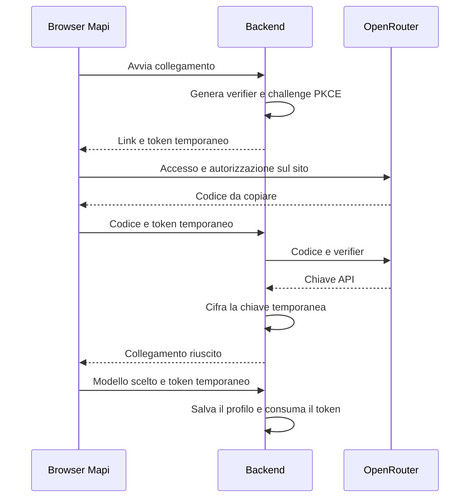
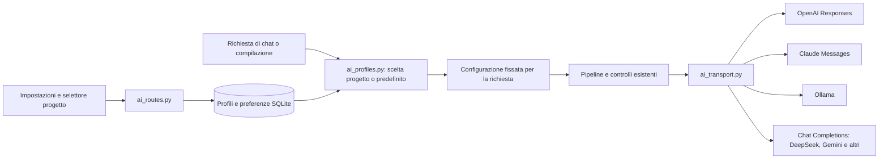

# Configurazione dei modelli AI

In **Impostazioni generali → Modelli AI → Aggiungi modello** si sceglie il
servizio dal menu a tendina del modulo, si collega l'account o si inserisce la chiave quando
previsto e si salva il modello da usare.
Ogni configurazione ha un nome: si possono salvare più modelli dello stesso
servizio, oppure affiancare servizi cloud e Ollama.

**Verifica collegamento e trova modelli** legge l'elenco disponibile sul servizio.
Non invia fonti, non genera una risposta e non dimostra la qualità del modello
nella compilazione. Il nome del modello si può anche inserire manualmente.

Il primo modello salvato diventa il predefinito. Nel progetto, l'ingranaggio
in basso a sinistra nel box della chat apre l'elenco dei modelli e il collegamento
alle impostazioni. Nella preparazione della candidatura è disponibile il menu
**Modello AI**. Si può seguire il predefinito o scegliere un modello specifico.
La scelta viene salvata nel database ed è comune a chat,
estrazione dei dati, generazione Markdown e compilazione DOCX.

| Servizio | Dati necessari | Collegamento del backend |
| --- | --- | --- |
| OpenAI | Chiave API e modello | `/models` per la verifica, `/responses` per la generazione |
| Anthropic / Claude | Chiave API e modello | `/models` con paginazione; `/messages` con `system` separato e header Anthropic |
| Google / Gemini | Chiave di Google AI Studio e modello | Endpoint compatibile `/v1beta/openai`, con `/models` e `/chat/completions` |
| DeepSeek | Chiave API e modello | `/models` per la verifica, `/chat/completions` per la generazione |
| Mistral | Chiave API e modello | `/v1/models` e `/v1/chat/completions` |
| xAI / Grok | Chiave API e modello | `/v1/models` e `/v1/chat/completions` |
| Groq | Chiave API e modello | Endpoint `/openai/v1`, con `/models` e `/chat/completions` |
| OpenRouter | Accesso con account oppure chiave API | `/key` verifica la credenziale, `/models` legge il catalogo pubblico, `/chat/completions` genera |
| Ollama | Servizio avviato e modello già installato | `/api/tags` per la verifica, `/api/chat` per la generazione |
| Altro servizio compatibile | Indirizzo base, modello, eventuale chiave | API Chat Completions con `response_format: json_object`; `/models` per la verifica |

Il collegamento parte dal server Mapi. Per Ollama, `127.0.0.1` indica quindi il
computer che esegue il backend, non necessariamente quello del browser. Ollama
può anche essere su un altro computer o server: il campo **Indirizzo del servizio**
è subito visibile nel modulo e accetta il relativo URL HTTP o HTTPS.
Il backend usa quell'indirizzo sia per leggere i modelli sia per la generazione.
L'interfaccia non installa Ollama e non scarica i modelli.
Per l'installazione WSL e i comandi di download: [Ollama locale](ollama-locale.md).

Il catalogo dei servizi è in `ai_providers.py`; l'interfaccia lo riceve dal
backend. I nomi dei modelli arrivano dalle API dei servizi. La selezione esclude
i modelli riconoscibili come destinati ad altri usi, come embedding e immagini;
per OpenRouter usa anche i metadati sul supporto al formato JSON. Questi filtri
non certificano la compatibilità di ogni modello né i suoi permessi di utilizzo.

## Accesso con account

Per OpenRouter, **Accedi con OpenRouter** prepara il collegamento e mostra un
link. L'utente lo apre, accede sul sito del servizio, autorizza il collegamento
e copia il codice nella schermata Mapi. **Collega account** recupera i modelli;
**Salva modello** conserva la configurazione. Il codice e il collegamento dopo
l'autorizzazione scadono ciascuno dopo dieci minuti. Si può ricominciare l'accesso.

È il flusso ufficiale [OpenRouter PKCE con codice manuale](https://openrouter.ai/docs/guides/overview/auth/oauth).
Non richiede un URL pubblico di ritorno e funziona anche con Mapi su localhost
o su una rete locale. L'utilizzo passa dall'account e dal credito OpenRouter.
Gli abbonamenti ChatGPT e Claude non vengono collegati da questa integrazione:
OpenAI e Anthropic richiedono la rispettiva chiave API.

`ai_login_flows` conserva l'hash del token, il verifier cifrato e poi la chiave
cifrata. La chiave ottenuta non viene restituita al browser. Il token temporaneo
rimane nello stato del form; non viene salvato nello storage del browser.
Il backend impedisce di riutilizzare il codice o destinare la chiave ottenuta
a un altro provider o indirizzo. I flussi scaduti vengono rimossi all'avvio
di un nuovo collegamento; un salvataggio riuscito elimina subito il proprio.

## Come passa la scelta al backend

`ai_profiles` conserva nome, servizio, URL, modello, finestra Ollama e chiave
cifrata. `ai_preferences` conserva il predefinito; `project_ai_settings` la
scelta specifica di ogni progetto. Lo schema viene aggiunto durante l'avvio,
senza ricreare progetti, fonti o compilazioni. La migrazione del vecchio vincolo
sui tre provider conserva profili, chiavi cifrate, predefinito e scelte dei progetti.

Prima della generazione, `project_ai_context()` legge una configurazione e la
mantiene in un `ContextVar`. Tutti i gruppi e le eventuali correzioni della
stessa compilazione usano quel modello e quelle credenziali. Cambiare le
impostazioni durante un'elaborazione vale per le richieste successive. Le
richieste concorrenti di progetti diversi hanno contesti separati.

`ai_transport.py` adatta il protocollo del servizio. Per OpenAI usa Responses
con `store: false`, `max_output_tokens` e formato JSON. Per Claude separa il
system prompt dai messaggi e richiede JSON attraverso le istruzioni esistenti.
Non usa Structured Outputs con uno schema specifico del provider: i contratti
rimangono verificati dall'applicazione. Per Ollama invia
`stream: false`, `format: json`, `think: false` e le opzioni `num_ctx` e
`num_predict`, poi normalizza la risposta nel formato già letto dalle pipeline.
Prompt, ricerca delle fonti, contratti JSON, controlli e writer DOCX restano
quelli dell'applicazione. Non c'è un passaggio automatico a un servizio diverso
in caso di errore.

Le risposte native vengono normalizzate prima della validazione. Una risposta
troncata o rifiutata non viene trattata come completata; nella compilazione Word
rimangono applicabili le regole esistenti di divisione dei gruppi e correzione.

La chat concede a Ollama fino a 180 secondi complessivi, compresi il caricamento
del modello e la generazione. Con `stream: false` il servizio invia il JSON al
termine: anche l'attesa dei dati HTTP è quindi di 180 secondi. Per gli altri
servizi restano 90 secondi complessivi e 30 secondi di attesa dei dati HTTP;
la connessione iniziale ha un limite di 10 secondi per tutti. I timeout sono
segnalati separatamente dagli errori di collegamento e non provocano un nuovo
tentativo automatico. Questi valori riguardano la chat; estrazione e compilazione
mantengono i propri limiti.

## Chiavi e configurazioni esistenti

Le chiavi API vengono cifrate con Fernet prima del salvataggio in SQLite.
Le risposte dell'API espongono soltanto `has_api_key`; non restituiscono la
chiave, neppure durante la modifica del profilo. Il browser non la salva in
`localStorage`. Il campo lasciato vuoto conserva la chiave precedente. Cambiare
servizio o URL richiede di reinserire la chiave oppure rimuoverla esplicitamente,
per evitare di inviare una credenziale salvata a un indirizzo diverso per errore.

La chiave di cifratura è nel file accanto al database, normalmente
`backend/data/mapi.ai-key`, con permessi `0600`. Il backup deve comprendere
**database e file `.ai-key`**. La cifratura separa le credenziali dal contenuto
leggibile del database; chi accede a entrambi i file può decifrarle. L'app non
introduce autenticazione o isolamento tra utenti: resta un prototipo da usare
su un computer o una rete fidata.

Al primo avvio, una precedente configurazione DeepSeek presente nell'ambiente
o nel `.env` viene importata come profilo modificabile. Dopo questo passaggio,
la gestione dall'interfaccia ha precedenza; eliminare il profilo non riattiva
silenziosamente la vecchia chiave. Per usare l'app non occorre più compilare il
`.env`. Lo script dimostrativo `compile_docx_demo.py`, che crea un database
isolato per il benchmark, mantiene invece la sua configurazione dall'ambiente.

Un profilo scelto esplicitamente da un progetto non può essere eliminato finché
il progetto non cambia selezione. Eliminare il predefinito lascia senza modello
i progetti che lo seguivano: l'interfaccia lo segnala nella conferma.

## Limiti del cambio modello

Supportare il collegamento non significa che ogni modello sappia compilare
correttamente i moduli. Deve rispettare i contratti JSON e gestire il contesto
richiesto. Il controllo delle citazioni non certifica l'interpretazione del campo.

I budget delle fonti, i gruppi di 32 posizioni, i limiti della risposta e i timeout
non vengono ricalibrati automaticamente quando si cambia modello. In Ollama la
finestra richiesta si imposta dalla UI, inizialmente a 32.768 token: non è una
misura della capacità effettiva di qualsiasi modello e non è stata ottimizzata
con benchmark. Con fonti estese può essere insufficiente; il servizio può
troncare il contesto o rifiutare la richiesta. Aumentarla richiede memoria e un
modello che la supporti. Anche un modello locale lento può superare i timeout.

La verifica automatica copre persistenza, migrazione, credenziali, PKCE,
selezione, concorrenza e generazione nei quattro percorsi per tutti i provider
con risposte HTTP simulate. Le prove browser
coprono impostazioni e scelta del progetto su desktop e mobile. Per valutare
qualità, tempi e memoria di un modello Ollama serve una prova con quel modello
installato e con i documenti di interesse.
