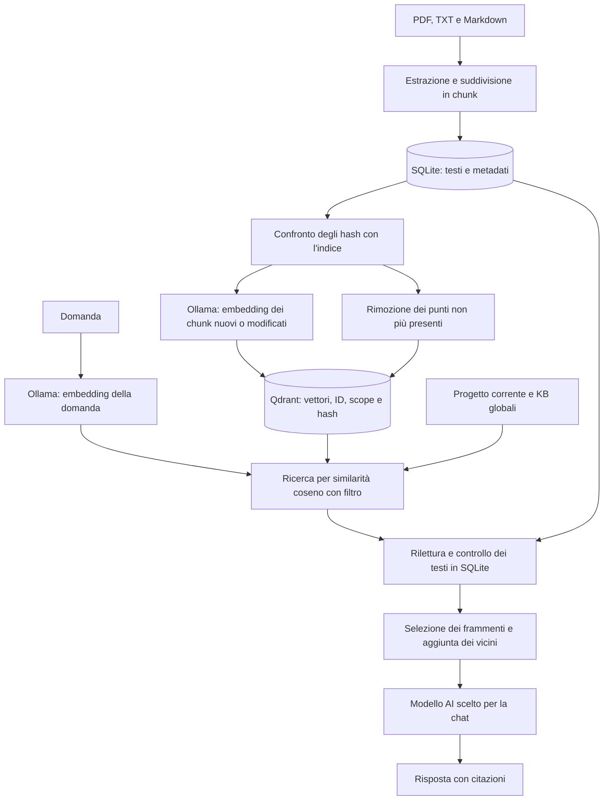

# Ricerca nelle fonti: Qdrant e FTS5

La chat può recuperare le evidenze con Qdrant oppure con FTS5. La scelta si
salva in **Impostazioni generali → Ricerca nelle fonti** e vale per tutti i
progetti. FTS5 resta disponibile per confrontare i risultati e per usare la
ricerca senza un servizio di embedding. Non c'è fusione dei due metodi.

Il modello che produce gli embedding è separato da quello che risponde nella
chat. Cambiare Gemma con Claude, per esempio, non richiede di ricostruire
l'indice; cambiare il modello di embedding sì.

## Avvio e configurazione

Le dipendenze Python includono `qdrant-client`. Dalla directory `backend`:

```bash
uv sync
ollama pull embeddinggemma
```

Il comando Ollama va eseguito sul computer che ospita il servizio di embedding.
Nelle impostazioni della ricerca:

1. Scegli **Vettoriale · Qdrant**.
2. Per l'archivio scegli **Locale sul server Mapi**, oppure un servizio Qdrant
   con indirizzo e chiave API facoltativa.
3. Imposta l'indirizzo Ollama e il modello di embedding. I valori iniziali sono
   `http://127.0.0.1:11434` e `embeddinggemma`.
4. Usa **Verifica collegamento**, poi **Salva ricerca**.
5. Usa **Aggiorna indice** per preparare le fonti prima della prima domanda.

`127.0.0.1` indica il computer che esegue il backend Mapi, non necessariamente
quello da cui si apre il browser. Ollama può essere remoto. Nelle opzioni
avanzate si può inserire una chiave per un servizio Ollama protetto e impostare
i prefissi richiesti dal modello per domande e documenti. I prefissi iniziali
sono vuoti: non ci sono regole diverse per ciascun bando.

La verifica genera l'embedding di una frase di prova e legge le collezioni
Qdrant; non invia i documenti e non salva la configurazione. L'aggiornamento
dell'indice usa invece le impostazioni salvate. Le chiavi sono cifrate con lo
stesso meccanismo dei profili AI e non vengono restituite al browser. Cambiare
l'indirizzo di un servizio richiede di reinserire o rimuovere la relativa
chiave salvata.

Una nuova installazione usa FTS5 finché non si salva la scelta Qdrant: non
scarica modelli né richiede Ollama all'avvio. L'indice vettoriale viene anche
sincronizzato prima di ogni ricerca, quindi il pulsante serve ad anticipare
quel lavoro. La prima ricerca può richiedere più tempo.

## Percorso di una domanda



Il filtro del progetto è incluso nella query Qdrant: opera prima della
selezione dei risultati migliori.

SQLite resta l'archivio principale. Qdrant contiene un vettore per chunk e un
payload con `chunk_id`, `scope` e `content_hash`; non duplica il testo. Gli ID
positivi identificano i chunk dei progetti, quelli negativi i chunk globali,
come nel contratto delle evidenze già usato dalla chat. Un UUID deterministico
li associa ai punti Qdrant.

Il corpus comprende le fonti ammesse del progetto, Company KB e General KB.
Template e bozze generate non diventano evidenze. Rimangono ammessi gli
artefatti di fatti già previsti dal filtro esistente: essere indicizzati non
significa che siano stati verificati da una persona.

## Aggiornamento e coerenza

Prima di cercare, il backend confronta i chunk SQLite con i punti Qdrant:
rimuove quelli obsoleti e calcola nuovi embedding soltanto quando cambia il
contenuto o un metadato rilevante. Caricare o eliminare una fonte non aggiorna
immediatamente Qdrant: la sincronizzazione avviene alla ricerca successiva o
con **Aggiorna indice**. L'indice FTS5 continua invece a seguire i trigger SQLite.

Gli embedding dei documenti vengono richiesti a gruppi di 24. Questo è un
raggruppamento del lavoro di indicizzazione; non cambia il numero di richieste
usato per compilare un Word.

La collezione dipende da un identificatore del database, dal servizio e modello
di embedding, dal digest del modello Ollama, dai prefissi e dalla dimensione
dei vettori. Un cambiamento prepara una collezione distinta, evitando di
mescolare vettori incompatibili. Le collezioni precedenti restano sul disco:
non c'è ancora una pulizia automatica.

Il backend controlla numero, dimensione e valori dei vettori. Chiede a Ollama
`truncate: false`: un testo troppo lungo deve provocare un errore, anziché
essere tagliato silenziosamente. Ricontrolla inoltre il digest dopo
l'indicizzazione; se il modello è cambiato durante il lavoro, scarta quella
collezione e richiede di riprovare.

Dopo la query rilegge i chunk da SQLite e verifica hash e appartenenza. Un
risultato eliminato o cambiato nel frattempo non viene passato al modello.
Se indicizzazione o ricerca falliscono, la richiesta segnala l'errore: non usa
silenziosamente FTS5. I gruppi già indicizzati possono essere riutilizzati al
tentativo successivo.

## Selezione e punteggi

La ricerca usa vettori densi e similarità coseno. Per i quattro frammenti
principali recupera fino a 24 candidati, limita la presenza iniziale di chunk
adiacenti dello stesso file e può aggiungere i vicini fino a otto evidenze.
La diversificazione e l'espansione mantengono il comportamento della chat
esistente; non c'è un reranker neurale.

Il campo `relevance` dei risultati principali contiene il punteggio coseno.
Non è una percentuale di correttezza e non è confrontabile direttamente con
il punteggio applicativo FTS5. I vicini aggiunti usano il punteggio derivato
previsto dall'espansione, non una nuova misura coseno.

Non è stata impostata una soglia di similarità ottimizzata. Qdrant può quindi
restituire frammenti poco utili quando nessuna fonte risponde alla domanda.
La presenza di un risultato non prova che la risposta esista: restano necessari
astensione del modello e valutazione su domande con e senza risposta.

## Modalità locale e servizio Qdrant

La modalità locale usa il client Python con persistenza in `<database>.qdrant`,
normalmente `backend/data/mapi.db.qdrant`. Non avvia un server separato e non
richiede Docker. È la modalità del client prevista per sviluppo, test e
prototipi: non va usata per attribuire al server Qdrant le prestazioni misurate
qui. Riferimento: [Qdrant Python client](https://github.com/qdrant/qdrant-client).

In locale il backend deve usare un solo processo; un lock serializza le
operazioni sull'indice. Per un server Qdrant si configura l'URL nelle
impostazioni. Il servizio remoto risolve il vincolo del file locale, ma prima
di distribuire Mapi su più worker va coordinata anche la sincronizzazione:
il lock applicativo attuale non è distribuito.

La sincronizzazione legge tutto il corpus e i metadati dell'indice a ogni
ricerca. Evita embedding ripetuti, ma il confronto cresce con i documenti.
Per corpus maggiori servirebbero aggiornamenti incrementali registrati durante
le modifiche e un lavoro di indicizzazione separato dalle richieste chat.

## Componenti e API

| Componente | Responsabilità |
| --- | --- |
| `retrieval.py` | Scelta tra il percorso FTS5 esistente e Qdrant. |
| `retrieval_settings.py` | Configurazione in SQLite, validazione degli indirizzi e chiavi cifrate. |
| `vector_retrieval.py` | Embedding Ollama, sincronizzazione Qdrant, ricerca e verifica delle evidenze. |
| `retrieval_routes.py` | API delle impostazioni e dell'indice. |
| `RetrievalSettingsPanel.tsx` | Configurazione, verifica e aggiornamento dalla UI. |

| Metodo e percorso | Effetto |
| --- | --- |
| `GET /api/settings/retrieval` | Legge le impostazioni senza rivelare le chiavi. |
| `PUT /api/settings/retrieval` | Salva la configurazione. |
| `POST /api/settings/retrieval/check` | Verifica la configurazione ricevuta senza salvarla. |
| `POST /api/settings/retrieval/index` | Sincronizza usando le impostazioni salvate. |

Le API della chat e della ricerca evidenze mantengono il contratto esistente.
Le operazioni bloccanti vengono eseguite nel thread pool del backend.

## Verifiche e perimetro

I test usano un indice Qdrant locale reale ed embedding controllati per
verificare isolamento tra progetti, esclusioni, modifiche, cancellazioni,
riuso dei vettori, cambio modello ed errori. I collegamenti remoti sono
verificati tramite risposte simulate, non con un server Qdrant remoto reale.

Sul corpus locale sono stati indicizzati 306 frammenti con `embeddinggemma`,
vettori di 768 dimensioni. La prima indicizzazione ha richiesto circa 46
secondi. Una domanda sulla PEC ha poi attraversato ricerca Qdrant e generazione
con `gemma4:e2b`, ottenendo la PEC simulata corretta con citazioni. I risultati
delle prove sono nei file locali `backend/data/qdrant-*-check.json`, esclusi
dal repository. Sono prove di funzionamento, non un benchmark di qualità o
prestazioni generalizzabile.

La compilazione DOCX continua ad assemblare le fonti entro i propri budget e
a inviare la richiesta unica prevista dal compilatore. Qdrant interviene nella
ricerca della chat, non interpreta i campi Word e non modifica il writer.

Per il confronto successivo con FTS5 servono le stesse domande, fonti e modello
di risposta, con evidenze e risposte attese controllate. Ragas può affiancare
questa valutazione; non è incluso in questa implementazione.

Riferimenti del protocollo: [API embedding Ollama](https://docs.ollama.com/api/embed)
e [modello embeddinggemma in Ollama](https://ollama.com/library/embeddinggemma).
