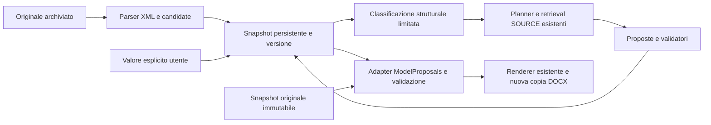

# CompilationSession V1: backend, chat e verifica

Una sessione riguarda un solo modulo DOCX archiviato nel progetto. L'iterazione
modifica dati persistiti; il file Word viene generato soltanto su richiesta.
La chat esistente offre selezione `@`, avvio/ripresa, riepilogo, chiarimenti
raggruppati e generazione/download inline. Il backend rimane la fonte dello stato.

**Stato del 7 ottobre:** i chiarimenti raggruppati passano le regressioni
software, ma la validazione reale è ancora incompleta. Il retry automatico può
mescolare errori di interpretazione PENDING con errori di proposta SOURCE
MISSING, consumando tentativi utili. La separazione dei batch per fase è il
prossimo intervento, ancora da implementare. Vedi [STATUS.md](../STATUS.md).

## Uso conversazionale nella chat

1. Caricare il DOCX nei **Moduli da compilare**. Digitare `@` nel composer e
   scegliere il modulo: la chip conserva `form_id`. «Riassumilo» e «cosa richiede?»
   usano FORM RAG, senza creare sessioni. I TXT sono contesto, non template DOCX.
2. Scrivere **«me lo compili?»**. Il planner esistente riconosce l'incarico e
   l'API crea/riprende la sessione della conversazione/form, senza passare al
   generatore RAG. Risposta: «Certo. Analizzo il modulo e verifico le informazioni
   disponibili». La scorciatoia **Avvia compilazione** rimane disponibile.
3. L'indicatore nel thread mostra attività e quantità reali, senza percentuali.
   La UI avanza in serie, un `resolve` per snapshot backend. Non serve premere
   un pulsante per ciascun gruppo da 12. Il budget è persistito, non React.
4. Il primo problema aperto **non interrompe l'analisi**: il backend raccoglie
   chiarimenti pendenti e continua sui candidate analizzabili entro il budget.
   Al checkpoint WAITING_FOR_USER propone **fino a quattro chiarimenti coerenti**.
   Una condizione condivisa ha priorità perché può sbloccare più field.
   Alternative SOURCE sono mostrate come scelte; una condizione dubbia richiede
   conferma di applicabilità. I pending e i dati mai ricercati non diventano
   domande o campi obbligatori.
5. Rispondere nel composer, ad esempio «12 giugno 2014». Con una domanda attiva
   singola il planner restituisce soltanto una decisione semantica e l'eventuale
   valore, **senza ID di campo**. Il backend conosce già il destinatario dalla
   domanda persistita e conserva il messaggio USER; verifica revisione e
   appartenenza letterale del valore al messaggio. Le date
   complete italiane possono diventare `12/06/2014` deterministicamente.
   Il valore è USER_PROVIDED, mai RESOLVED da SOURCE. Gli altri campi restano
   invariati. Risposte ambigue, più date o proposte non grounded chiedono un
   chiarimento, senza cambiare valori. Una nuova domanda documentale resta RAG.
6. «No» a una domanda di applicabilità esclude **i candidate legati alla stessa
   condizione e allo stesso contesto strutturale**, con
   provenance USER e motivo. «Sì» conferma la condizione, non fornisce un valore
   fattuale: il campo torna PENDING prioritario e viene ricercato nelle SOURCE;
   soltanto se la ricerca non verifica il valore, la chat lo chiede. «Non lo so»
   non esclude nulla: registra UNKNOWN e passa oltre, lasciando la voce aperta.
7. A un gruppo si può rispondere in un unico messaggio, anche numerato. Il
   planner restituisce decisioni per slot 1–4, mai ID di campo. Risposte parziali
   aggiornano soltanto gli elementi identificati; un elemento ambiguo rimane
   aperto senza annullare gli altri aggiornamenti validi. UNKNOWN/SKIP possono
   riguardare un singolo elemento. Dopo l'input valido la sessione continua
   automaticamente se ha lavoro disponibile, altrimenti conserva solo le domande
   non risposte del gruppo prima di proporne un altro. Con READY chiede **«Vuoi che generi
   il DOCX?»**: confermare in chat o premere **Genera DOCX**. Non viene prodotta
   una bozza incompleta implicitamente. Download DOCX e report nel thread.
8. «salta»/«passa oltre» registra SKIP senza cambiare valore, status fattuale o
   provenance; «non lo so» registra UNKNOWN. La chat passa al prossimo problema
   oppure continua sui pending. I rinvii non vengono richiesti immediatamente.
   Se restano solo questi, mostra un riepilogo senza loop e non genera il DOCX.
9. «basta»/«fermati» mette in pausa la stessa sessione, anche durante l'analisi:
   nessuna domanda attiva né avanzamento automatico. «riprendi» conserva i campi
   e rinnova un ciclo; sul riepilogo dei rinvii riapre una sola voce.
10. Ricaricare/riaprire: stato, domanda e budget sono riletti dal backend. Chiudere
   la pagina interrompe l'orchestrazione frontend, non elimina la sessione.
   Un claim attivo viene seguito con polling GET; scaduto, si propone una ripresa
   esplicita ad alto livello, senza chiedere all'utente di gestire i batch.

**Dettagli compilazione**, chiuso inizialmente, contiene la precedente scheda:
conteggi candidate/pending, ID e prove, Continua analisi, Aggiorna stato,
Chiarisci/Correggi e input manuale, ricerca singolo campo, reset, motivo di
non applicabilità e generazione incompleta **esplicita**. Serve per trasparenza,
compatibilità e correzioni avanzate, non come percorso primario.

### Routing, API e persistenza

- `/answer` accetta `form_id` e, per una domanda della sessione visualizzata,
  `compilation_session_id` + `compilation_version`. Il backend verifica progetto,
  conversazione, documento e revisione prima di aggiornare. Un cambio concorrente
  risponde 409: rilettura, nessuna ripetizione della mutazione. Unica eccezione:
  una **pausa** può usare una revisione precedente, perché un claim può averla
  appena incrementata. La transazione conserva lo stato corrente e invalida il
  claim; risultati/fallimenti tardivi non possono sovrascrivere la pausa. Il
  provider già in volo può terminare, ma il risultato non viene applicato.
- Con una sola domanda attiva, il planner usa `ActiveQuestionPlan`:
  `VALUE`, `CONDITION_TRUE`, `CONDITION_FALSE`, `UNKNOWN`, `SKIP`, `REFUSE`,
  `PAUSE`, `CLARIFY`; eventuali `value`, `normalized_value` e `rationale`.
  Il modello non vede né restituisce ID di campo/sessione/versione; il backend
  lega la risposta al target del proprio snapshot, controllandone la revisione.
  CONDITION_FALSE è ammessa soltanto per una domanda di applicabilità e non
  scrive un valore; CONDITION_TRUE richiede poi la ricerca SOURCE. Il messaggio
  USER intero rimane la provenienza; rationale non è una prova fattuale.
  `CHAT` contiene il normale routing se l'utente fa una nuova domanda, senza
  aggiungere una chiamata di classificazione. Non accetta selezioni di field.
  Nessuna nuova keyword/polarità hardcoded; gli stessi guard di controlli e
  alternative già esistenti restano come protezioni conservative.
- Per un gruppo attivo persistito il planner usa `ClarificationGroupPlan`:
  `ANSWER` con massimo quattro `replies[{slot,action,value,normalized_value,
  user_quote,rationale}]`, `PAUSE` senza risposte, oppure `CHAT` con normale
  routing. Le azioni per slot sono VALUE, CONDITION_TRUE/FALSE, UNKNOWN, SKIP,
  REFUSE e CLARIFY. Il prompt espone soltanto posizioni, domande e contesto,
  **non field_id/session_id/version**. Il backend verifica slot ammessi e unici,
  estratti USER e revisione, poi applica ai destinatari già noti. Nelle risposte
  numerate, l'estratto deve appartenere proprio alla clausola di quello slot;
  alternative nella stessa clausola impediscono una scelta arbitraria.
  Un «sì/no» isolato con più destinatari non aggiorna arbitrariamente un field.
  Una risposta non associata viene chiarita e, dopo un secondo tentativo,
  differita; nessun loop e nessun valore inventato.
- Senza target singolo o gruppo coerente (nessuna domanda, workflow non abilitato
  o sospeso) rimane il planner generale; non si sceglie arbitrariamente un campo.
  Questo conserva reply/retrieve (FORM/SOURCE/MIXED) e `compile`,
  `compilation_input`, `compilation_clarify`, `compilation_generate`,
  `compilation_control`. Quest'ultima ha `control={kind,field_id,user_quote}`:
  kind unknown/skip/refuse riguarda soltanto la domanda corrente;
  pause/resume riguarda la sessione. Estratto grounded nell'ultimo messaggio USER,
  nessun valore proposto. Il routing è semantico; un guard circoscritto ai comandi
  interi inequivoci impedisce reply/set errati anche se il planner sbaglia.
  Nessuna seconda chiamata classificatrice. Le azioni
  workflow passano al service esistente **prima** del RAG. Il guard non sostituisce
  il planner semantico. La sola mention non dà incarico né prova valori.
- `field_replies` contiene internamente `field_id`, `action=set|not_applicable|applicable`,
  `value`, `user_quote`: per la domanda singola questi input sono costruiti dal
  backend, non restituiti dal modello. Il backend accetta soltanto il campo
  chiesto. I valori devono appartenere all'ultimo messaggio USER, non al FORM,
  allo storico o alle alternative SOURCE. Restano i validatori DOCX della V1.
- Risposte e turni conservano `compilation={session_id,action}` opzionale in
  `conversation_turns.compilation_json`, nuova colonna additiva. Restano
  `form_reference`, `selected_form_id` e `form_reference_json` già implementati.
- `chat_workflow` nello snapshot JSON conserva inizio ciclo, passi consumati,
  pausa, tentativi automatici per field e chiarimenti pendenti/attivi con slot,
  destinatari e fingerprint. `user_paused` è distinto da pausa per budget/errore;
  lo status di dominio può restare WAITING_FOR_USER mentre la conversazione è
  sospesa. `conversation_disposition` nel field conserva unknown/skip/refuse/
  uninterpretable, estratto USER, data e fingerprint. Il confronto esclude
  timestamp/versioni: un refresh o un semplice chiarimento non riapre il campo.
  Un cambiamento significativo o una revisione esplicita può riaprirlo.
  Le revisioni conservano anche il workflow. Nessuna nuova tabella/motore RAG.
  La proiezione backend `chat` espone domanda, avanzamento autorizzato e quantità effettive;
  `chat.metrics` conserva/espone automatic_resolved, user_required_fields e
  user_turns (messaggi di risposta ai chiarimenti, esclusi avvio/pausa/ripresa).
  I field differiti restano conteggiati come irrisolti e la risposta UNKNOWN/SKIP
  conta un turno; i dati non ancora ricercati non sono dichiarati USER-required.
  il frontend non riclassifica i field.
- `POST /compilation-sessions` con `start_in_chat=true` mantiene creazione atomica
  e riuso della coppia. Un avvio/ripresa esplicito rinnova un ciclo esaurito,
  una sessione legacy, un FAILED o un claim scaduto, senza azzerare i valori.
  Gli input USER validi iniziano un nuovo ciclo; GET/refresh non lo rinnovano.
- `POST /{id}/resolve` con `automatic=true` richiede budget e lavoro disponibili.
  Gli irrisolti non interrompono gli altri candidate analizzabili. Non consente
  `field_ids`; l'opzione manuale
  precedente rimane.
- La UI mostra una sessione, del modulo selezionato o la più recente nella
  conversazione. Una selezione non ancora inviata rimane una bozza locale.
  Cambio progetto/conversazione/modulo annulla le richieste UI; risultati già
  salvati dal backend rimangono recuperabili.

Riavviare il backend per la colonna additiva. Nessuna reindicizzazione o modifica
agli originali. Sessioni legacy si attivano esplicitamente; sessioni standalone
non vengono associate arbitrariamente a una conversazione.

### Budget del ciclo conversazionale

Massimo **36 passi**, ciascuno da **12 candidate** e fino a **3 chiamate LLM**
(rimangono i budget SOURCE della V1). Al massimo **108 chiamate di risoluzione**
per ciclo, più planner dei messaggi utente ed embedding. Non si ammettono nuovi
passi dopo **600 secondi** dall'inizio; un passo già avviato può terminare entro
il proprio timeout di 180 secondi. Stop su checkpoint senza altro lavoro
automatico disponibile, pausa USER, READY, GENERATED, FAILED o errore HTTP.

Ogni candidate ha al massimo **due tentativi automatici**, persistiti anche
attraverso pausa/refresh e rinnovo del ciclo. La seconda analisi prioritaria dei
candidate con errori di validazione usa un batch più piccolo, massimo **sei**,
senza chiamate per singolo campo. Un'interpretazione PENDING o un estratto
respinto possono così essere riesaminati una volta prima di chiedere un dato;
esauriti i tentativi, un PENDING non viene trasformato in una domanda USER.
Una dipendenza esplicitamente confermata riabilita la ricerca dei soli field
coinvolti. Non ci sono retry illimitati o nuovo motore SOURCE.

Un JSON di risoluzione non conforme allo schema non applica **nessuna proposta**
del batch. Solo nel workflow automatico raggruppato la API recupera questo
specifico errore usando i medesimi due tentativi persistiti: una seconda analisi
più piccola, poi gli altri candidate. `output_rejections` e l'ultima lista di
candidate rifiutati restano nello snapshot e nelle revisioni. La risposta HTTP
espone lo stato corrente; la UI prosegue solo se `chat.auto_continue=true`.
Provider/timeout/parser/storage e gli altri errori tecnici restano FAILED.
Una pausa o correzione concorrente prevale sul recupero. Esauriti i tentativi,
gli elementi non interpretati restano PENDING; se non c'è né altro lavoro né un
chiarimento legittimo, la sessione si ferma con un errore esplicito. Non si
trasforma un difetto di classificazione in una richiesta di valori all'utente.

Priorità/raggruppamento in `compilation_clarifications.py`: condizioni grounded
uguali, soggetto/ruolo e contesto strutturale uguali vengono condivisi; l'impatto
è il numero dei field influenzati. Prima i gruppi a impatto maggiore, poi le
condizioni, poi i valori locali. Si scelgono fino a quattro slot dello stesso
tipo e soggetto/contesto. La propagazione riusa soltanto una prova SOURCE/USER
già validata, mai una supposizione sul tipo di azienda. Condizioni o contesti
diversi e prove discordanti non vengono unificati. La V1 resta conservativa
quando la medesima condizione è parafrasata o appare in sezioni diverse.

Al checkpoint di budget si possono chiarire i problemi già analizzati; quelli
non ricercati rimangono PENDING/non searched. Riprendere rinnova il budget di
tempo/passi ma conserva i tentativi e le risposte. Il backend conserva il gruppo
in pausa, mentre `chat.question=null` lo nasconde: riaprire/riprendere conserva
gli slot non risposti, senza ricreare la sessione.

Al limite, il thread spiega che l'analisi si è fermata e offre **Prosegui
compilazione**, o accetta un incarico equivalente in chat. Questa nuova azione
utente rinnova il budget; non parte un nuovo ciclo automatico. Non ci sono loop
illimitati, worker in background o chiamate per ogni singolo campo.

## Pipeline riutilizzata

`inspect_docx()` valida il contenitore e individua le celle XML scrivibili,
con ID `t{tabella}.r{riga}.c{cella}`, e i segnaposti di paragrafo, con ID
`p{paragrafo}.s{segnaposto}`. Gli indici sono zero-based e dipendono
dall'originale. Celle unite, controlli Word, firme e contenuti complessi
mantengono i controlli del parser esistente. Le firme non vengono scritte.

Il percorso precedente, ancora disponibile su `/document-compilations`,
invia tutti i cataloghi e le fonti selezionate in una chiamata. Lo schema
`ModelProposals` contiene `cell_id`, `label`, `entity`, `kind`, `status`,
`value`, `evidence[{source_id,quote}]`, `reason`. `validate_proposals()`
verifica ID, estratti, valori, integrità numerica, email e protezioni;
`fill_docx()` riapre l'originale e applica i valori validi. Gli script esistenti
e questo percorso non sono stati convertiti in sessioni implicitamente.

La nuova pipeline è:



Il RAG non determina dove scrivere. Il collegamento candidate/posizione rimane
quello del parser. Il contesto FORM è strutturale: conserva file, progetto,
nome, ruolo, posizione e hash; `chunk_id=null` è intenzionale perché non è un
frammento recuperato dall'indice.

## Persistenza e stati

Due tabelle additive, create dal normale avvio del backend:

- `compilation_sessions`: progetto, modulo, conversazione opzionale, originale
  come BLOB, snapshot JSON dei candidate, versione intera e timestamp.
- `compilation_session_revisions`: versione, azione, prima/dopo dei soli campi
  cambiati, stato e riferimento all'eventuale documento generato.

`document_fields` appartiene alla revisione dimostrativa, senza identità DOCX.
`document_compilations` rappresenta risultati immutabili: viene riusata per
ogni generazione, insieme a storage e download già esistenti. La registrazione
dell'output e della revisione di sessione usa una sola transazione; gli errori
di salvataggio ripuliscono i file appena creati.

La creazione legge l'originale archiviato e salva tutti i candidate, massimo
400 secondo il parser. Non richiede AI né fonti e non genera una bozza.
Lo snapshot permette la ripresa dopo riavvio e resta utilizzabile anche se
il modulo viene rimosso dall'archivio: `form_id` diventa null, restano hash,
`original_file_id`, riferimento storico e copia dei byte. La cancellazione
del progetto elimina sessioni e revisioni tramite le relazioni esistenti.
Non vengono migrate vecchie compilazioni, reindicizzati moduli o modificati
gli originali. Per questo percorso non serve che il form abbia già frammenti.

| Campo | Significato |
|---|---|
| `PENDING` | Candidate non analizzato, interpretazione non verificata o ricerca rinviata per budget. Non è dichiarato obbligatorio o mancante. |
| `RESOLVED` | Valore letterale in una SOURCE ammessa, associato al requisito/soggetto e accettato dal validatore DOCX. |
| `MISSING` | Campo interpretato, ricerca pertinente eseguita, nessun valore accettato nelle evidenze recuperate. |
| `AMBIGUOUS` | Più alternative oppure significato, scelta o applicabilità da chiarire. Nessun valore scelto. |
| `CONFLICTING` | Proposte incompatibili dello stesso dato, ciascuna con supporto SOURCE valido. |
| `NOT_APPLICABLE` | Esclusione esplicita utente/SOURCE; oppure classificazione strutturale di spazio decorativo senza etichetta. Nessun valore scritto. |
| `USER_PROVIDED` | Valore esplicito dell'utente, con provenienza USER; non viene presentato come verificato in un documento. |

`USER_PROVIDED` è uno stato distinto per evitare di confondere la conferma
utente con `RESOLVED`. `provenance` separa ulteriormente SOURCE, USER e FORM:
FORM può classificare uno spazio decorativo, ma non verificare un valore.
Prove documentali mantengono chunk/file, nome, ruolo, progetto, scope, categoria,
contenuto ed estratto. Alternative e conflitti conservano tutte le proposte
accettate, fino a quattro per campo.

Stati sessione: `CREATED`, `ANALYZING`, `WAITING_FOR_USER`, `READY`, `GENERATED`,
`FAILED`. Se rimangono soltanto candidate da analizzare, lo stato torna
`CREATED`; `summary.pending` indica che serve continuare. Con missing,
ambiguous o conflicting diventa `WAITING_FOR_USER`, anche se restano pending.
`READY` significa che non ci sono candidate bloccanti nello stato corrente:
non certifica la completezza amministrativa del modulo. `GENERATED` indica
che è stata prodotta una copia; una modifica successiva ricalcola lo stato.

## Condizioni di applicabilità e protezione contro le ripetizioni

`condition` è ricavata dal contesto FORM e verificata sul testo originale dal
classificatore esistente; non viene estratta dal messaggio dell'utente. Non si
hardcodano campi, ruoli o sezioni del DOCX. `applicability` conserva condizione,
`applies=true|false`, provenienza USER/SOURCE e relativa motivazione/prova.
L'assenza di questa informazione rappresenta UNKNOWN.

Il matcher già esistente può proporre `applicability[]` nello stesso batch, con
`applies`, `source_id`, `quote`, `value` (asserzione completa letterale). Il gate
controlla SOURCE ammessa, grounding, parole del predicato e polarità locale;
respinge ipotesi, negazioni lontane, prove FORM e asserzioni inventate. Un
estratto non può eliminare il «non»/«se» precedente nella clausola SOURCE. La
conferma USER considera anche il messaggio completo, non una frase troncata.
Prove contraddittorie non scelgono un'applicabilità. Rimane compatibile anche la vecchia
esclusione SOURCE con dichiarazione esplicita. Le prove di applicabilità SOURCE
sono rilette prima di salvare e generare, come quelle dei valori.

- Falso -> NOT_APPLICABLE, con prova SOURCE oppure indicazione USER; niente valore.
- Vero -> ricerca/validazione del valore con SOURCE. Senza valore -> MISSING;
  valore verificato -> RESOLVED. Una conferma della condizione non è un valore.
- Sconosciuto -> AMBIGUOUS e domanda sulla condizione, prima del valore.
  Per compatibilità si fa la stessa domanda anche per vecchi MISSING condizionali.

Esempio: il FORM indica «(se procuratore) estremi procura». Prima si chiede se
questa condizione si applica. «non sono procuratore» esclude solo il field chiesto
con USER; «Sì» conserva applicabilità USER e cerca gli estremi nelle SOURCE;
se assenti, li chiede. «salta» differisce la voce senza escluderla. Non si deduce
un falso dall'assenza di fonte né si decide il ruolo dalla sola forma giuridica.
Una condizione già grounded resta tale anche se il classificatore la omette
nel passaggio successivo. Non si propagano decisioni a intere sezioni.

Una risposta ambigua/non valida permette **un chiarimento** sullo stesso stato.
Una seconda non interpretabile differisce il campo invece di chiedere ancora la
stessa cosa. SKIP, UNKNOWN e rifiuto differiscono subito. I problemi irrisolti
continuano a bloccare una generazione completa; una bozza incompleta rimane una
scelta esplicita nei dettagli. Se tutti sono rinviati, la chat mostra max cinque
nomi e il conteggio residuo: una richiesta esplicita di ripresa può rivederne uno.

Nessuna migrazione/reindicizzazione richiesta per questa correzione. Riavviare
backend e frontend. Nella diagnosi della precedente correzione dei controlli
il DB locale era stato letto soltanto in modalità read-only; tutti i test software
usano storage e DB temporanei. Il benchmark single-field del 7 ottobre, descritto
sotto, crea invece due nuove sessioni attraverso le normali API, senza modifiche SQL.

## Un passo automatico e i suoi limiti

Ogni `resolve` tratta al massimo **12 candidate**. L'unità è un gruppo di
posizioni selezionate, ciascuna con contesto della tabella o del paragrafo.
Non è il vecchio motore DOCX a gruppi da 32: qui ogni richiesta termina con
uno stato persistito e non produce né modifica Word.

1. Una chiamata classifica i candidate e propone requisiti atomici, con nome,
   ruolo personale ed estratto FORM. Gli estratti devono appartenere al
   contesto del candidate e l'etichetta al suo riferimento strutturale.
2. Il planner SOURCE già usato da MIXED raggruppa gli ID: al massimo una
   chiamata, saltata con uno/due requisiti. Rimangono sei gruppi, quattro
   requisiti per gruppo, due query e quattro evidenze per gruppo.
3. FTS5 o Qdrant cerca solo SOURCE, con gli stessi scope e filtri esistenti.
   Il budget massimo è **12 ricerche / 24 evidenze** per passo. Ogni candidate
   ricercato conserva query e chunk ammessi; gli esclusi restano `PENDING`
   con `search.status=coverage_limit`.
4. Una chiamata propone valori/alternative nei bucket ammessi. Nessuna
   chiamata se le SOURCE sono vuote. Grounding e associazione riusano
   `validated_supports`; `validate_proposals` conserva i controlli DOCX.
   Non si sceglie un valore fra proposte diverse. Non ci sono retry automatici.

Massimo **tre chiamate chat LLM per richiesta**, oltre alle eventuali chiamate
embedding del retriever esistente. `last_resolution` riporta candidate,
gruppi, query, copertura, evidenze e numero di chiamate. Non ci sono confidence
numeriche. Durata massima del passo: 180 secondi; claim persistito di 240
secondi. Dopo un crash, scaduto il claim, una richiesta con versione corrente
può riprendere; un risultato vecchio non può sovrascrivere il nuovo stato.

Con 279 candidate, un primo attraversamento richiede almeno 24 passi HTTP,
automatizzati nel percorso chat entro il budget del ciclo; al massimo 72 chiamate
chat se ogni passo arriva a tutte le fasi.
Con 400 candidate: 34 richieste / 102 chiamate per un attraversamento.
Questi numeri non promettono una risoluzione completa: gli elementi ancora
pending o ambigui possono richiedere interventi successivi. Non esiste un
ciclo illimitato che consumi questo budget. Senza `field_ids`, i pending mai
analizzati hanno precedenza sui rinviati per analisi, salvo il candidate con
condizione appena confermata da USER, che ha priorità nella ricerca SOURCE, evitando che un'omissione blocchi
la scansione. Il contesto strutturale del passo ha limite 60.000 caratteri:
se lo supera, il passo fallisce senza perdita di stato e si può ridurre il
gruppo. Tabelle singole troppo grandi richiedono revisione manuale.

## API e prova manuale

Prefisso: `/api/projects/{project_id}/compilation-sessions`.
Sono consultabili anche in `/docs`, senza implementare una pagina frontend.

| Metodo e suffisso | Corpo / risultato |
|---|---|
| `POST /` | `{"form_id":42,"conversation_id":null}` → sessione standalone; aggiungere `start_in_chat:true` per creare anche la conversazione. Con conversation_id si riusa la sessione della coppia. |
| `GET /` | Elenco sessioni e riepiloghi del progetto; filtro opzionale `conversation_id`. |
| `GET /{id}` | Stato completo, summary, open_issues, provenienza e ultimo output. |
| `POST /{id}/resolve` | `{"version":1}` oppure versione corrente + `field_ids` (massimo 12). |
| `PATCH /{id}/fields` | Versione corrente e `fields[{field_id,action,value,reason}]`. |
| `GET /{id}/revisions` | Cronologia persistente prima/dopo. |
| `POST /{id}/finalize` | Versione corrente; `allow_unresolved=false` di default. |

Nei percorsi il suffisso `/` rappresenta il prefisso senza slash finale.
I download sono quelli restituiti in `last_generation.downloads`:
`/api/projects/{project_id}/document-compilations/{run_id}/download/{docx|report|template}`.
Ogni generazione ha un nuovo `run_id`, report e copia dell'originale.

Per la prova:

1. Riavviare il backend; caricare un DOCX nei moduli di un progetto di prova.
   Creare una sessione con il suo ID. Verificare `summary.pending` e scaricare
   l'originale dall'archivio per confrontarne i byte.
2. Scegliere il profilo AI del progetto e fonti realmente pertinenti. Eseguire
   `resolve` usando la versione restituita, poi leggere la sessione con GET.
   Per il DOCX demo, si possono selezionare soltanto i candidate della tabella
   riportata sotto, evitando di elaborare prima tutte le altre sezioni.
3. Controllare `requirement`, `form_evidence`, `source_evidence`, `search`,
   `validation_errors` e `alternatives`. Le SOURCE globali mantengono category
   company/general; quelle di progetto il rispettivo project_id.
4. Per fornire un dato usare, ad esempio:

   ```json
   {
     "version": 3,
     "fields": [
       {"field_id":"t26.r2.c1","action":"set","value":"15 giugno 2010","reason":"Dato fornito dall'utente"}
     ]
   }
   ```

   Il valore e la versione sono esempi: usare il dato reale e la versione
   appena letta. `action=not_applicable` richiede una motivazione e nessun valore;
   `action=reset` azzera il valore e rimette il candidate pending. I campi già
   decisi non sono riesaminati automaticamente: serve reset esplicito.
5. Rileggere stato e revisioni anche dopo riavvio. Ogni mutazione usa la
   versione corrente, altrimenti risponde 409; resolve cambia versione sia
   all'acquisizione del claim sia al completamento.
6. Finalizzare: problemi aperti, inclusi pending, bloccano l'operazione con
   409. Per una bozza parziale usare esplicitamente `allow_unresolved=true`.
   I campi non risolti rimangono vuoti. `summary` e `open_issues` sono nel report.
7. Modificare un valore e finalizzare di nuovo. Controllare due output distinti,
   lo stesso hash/template e il nuovo valore. Nessuna bozza entra negli indici.

Le SOURCE vengono rilette prima di salvare la risoluzione e prima di esportare,
anche nella transazione di salvataggio del risultato: fonti cancellate,
mutate o non più ammesse bloccano l'operazione. Il valore USER può confermare
una scelta esplicita, anche «No», ma non aggira validazioni di formato, email,
posizione o firma. Il percorso AI precedente non riceve questa autorizzazione.

## Esempio verificato nei test software

Il DOCX `domanda-partecipazione.docx` reale della fixture contiene **279**
candidate grezzi. Il test seleziona otto posizioni 5.d, con fonti simulate
caricate in ambiente temporaneo e provider simulato. Risultato: sette
resolved, una missing, 271 pending. Non è un benchmark DeepSeek/Gemma.

| Candidate | Requisito | Valore nel test | Stato | Provenienza |
|---|---|---|---|---|
| `t25.r0.c1` | Denominazione sociale | Mapi Ingegneria S.r.l. | RESOLVED | SOURCE Company KB, chunk ed estratto persistiti |
| `t25.r4.c1` | Forma giuridica | Società a responsabilità limitata | RESOLVED | SOURCE Company KB |
| `t25.r4.c3` | Sede legale | Via Test 12, Bari | RESOLVED | SOURCE di test, nessun indirizzo dedotto dal modulo |
| `t26.r0.c1` | Nome e cognome del direttore tecnico | Elisa Romano | RESOLVED | SOURCE con ruolo personale |
| `t26.r1.c1` | Qualifica professionale | Ingegnere | RESOLVED | SOURCE con ruolo personale |
| `t26.r3.c1` | Ordine professionale | Ordine degli Ingegneri di Bari | RESOLVED | SOURCE con ruolo personale |
| `t26.r4.c1` | Numero albo | 8421 | RESOLVED | SOURCE con relazione locale iscrizione/numero |
| `t26.r2.c1` | Data di abilitazione | null | MISSING | Requisito FORM, nessuna SOURCE sufficiente |

Gli ID dei chunk sono quelli del database temporaneo di ciascun test; non
vengono spacciati per ID delle KB locali dell'utente. Cambiando le fonti,
cambiano i valori risolvibili. L'organigramma è un allegato richiesto nel
testo, non una posizione scrivibile identificata come tale dal parser: la V1
non inventa un candidate e non dichiara l'allegato disponibile. La gestione
degli obblighi senza candidate strutturale resta da collegare successivamente.

## Verifiche precedenti del workflow conversazionale (storico)

Il 6 ottobre 2026: 50 nuovi casi backend conversazionali FTS5/Qdrant con provider
simulati e storage temporaneo; **945 test backend complessivi**, Ruff; **78 test
frontend**, Oxlint e build TypeScript/Vite. Browser: **8 casi Chromium** con API
simulate, desktop/mobile e prefers-reduced-motion, su compilation-chat,
composer-model-menu e project-forms. Coperti routing dedicato, avanzamento senza
click per batch, budget persistito, WAITING/READY dopo refresh, ambiguità senza
update, risposta libera USER, generazione/download e isolamento. Questi esiti
non misurano la qualità di DeepSeek/Gemma; il benchmark reale resta da eseguire.
Comandi e punto di ripresa in [STATUS.md](../STATUS.md).

## Verifiche della correzione conversazionale precedente (storico)

- Backend: **79 nuovi test** per controlli/applicabilità/differimenti, con provider
  simulati e DB/storage temporanei (FTS5/Qdrant dove applicabile). Test mirati
  su sessioni/conversazione eseguiti prima della suite backend
  finale completa: **1024 passati**. Ruff superato sullo stato finale.
- Frontend: **83 passati in 12 file**, inclusi SKIP/UNKNOWN, pausa/refresh/ripresa e
  invio di «basta» durante un passo in corso e negazione della condizione. Oxlint e build TypeScript/Vite passati.
- Browser Chromium: **8 passati**, API simulate, desktop/mobile e movimento
  ridotto; scenari compilation-chat, composer-model-menu, project-forms. Aggiunti
  salta/unknown/ripresa, pausa senza domanda dopo refresh, nessuna mutazione dei
  valori rinviati, oltre al flusso USER -> READY -> download. Frontend separato
  porta 5193; nessun uso del backend/storage locale dell'utente.
- `git diff --check` e controllo whitespace dei file nuovi superati. Nessun
  benchmark con provider reale: i test verificano il software, non DeepSeek/Gemma.

Comandi realmente eseguiti: `uv run --locked pytest -q tests/test_compilation_controls.py`,
`uv run --locked pytest -q tests/test_compilation_controls.py tests/test_compilation_conversation.py`,
`uv run --locked pytest -q tests/test_compilation_conversation.py tests/test_compilation_sessions.py tests/test_compilation_session_guards.py`,
`uv run --locked pytest -q`, `uv run --locked ruff check .`; frontend `npm test`,
`npm run lint`, `npm run build`,
`PLAYWRIGHT_BASE_URL=http://127.0.0.1:5193 npm run test:e2e -- compilation-chat.spec.ts composer-model-menu.spec.ts project-forms.spec.ts`.

## Verifica del contratto single-active-field — 7 ottobre 2026

Il test reale precedente falliva con «no» e parafrasi negative perché DeepSeek
copiava `id` dal contesto, mentre lo schema richiedeva `field_id`: la negazione
era capita, ma primo tentativo e retry erano respinti. Il contratto single-field
separa ora scelta semantica e destinatario deterministico backend. Un solo retry
continua a essere consentito, includendo schema originale ed errori precisi.

Test software finali: **252 mirati**, **1067 backend completo**, Ruff e diff check
passati; provider simulati, DB/storage temporanei, FTS5/Qdrant. Nessun codice o
contratto frontend cambiato: test/lint/build frontend e browser non rieseguiti.

Due prove con **deepseek-flash reale**, codice congelato, originali e sessioni
precedenti conservati: negazione completa e «no» restituiscono CONDITION_FALSE
senza ID, senza errori e senza retry. Il target noto al backend diventa
NOT_APPLICABLE / USER, valore nullo; gli altri field restano invariati e viene
posta la domanda successiva. Nella prima preparazione il classificatore aveva
lasciato la procura PENDING per label non grounded: necessario un resolve
mirato tramite API, non una modifica SQL. La seconda raggiunge la domanda
direttamente con il primo passo automatico. La correzione non risolve quel
limite di classificazione e non certifica la compilazione completa.

Prompt, schemi, raw, errori e transizioni sono documentati in
[test-reale-active-question-2026-10-07.md](test-reale-active-question-2026-10-07.md).
Il POST di chiarimento usa la stessa API FastAPI via ASGITransport, con provider
reale e normale persistenza, per osservare il raw; preparazione/rilettura usano
il server HTTP corrente. Nessuna risposta/API di provider simulata nel benchmark.
Nessuna migrazione o reindicizzazione: caricare il codice backend aggiornato.

## Collegamento SOURCE dei candidate — 7 ottobre 2026

Il piano SOURCE della compilazione riusa i limiti/gruppi del motore esistente,
con un output specifico: cluster di requirement_id e fino a tre etichette
semanticamente equivalenti della proprietà. Non crea requisiti o valori;
il requirement FORM originale resta quello validato dal classificatore.
I contesti strutturali sono deduplicati e le query restano sintetiche,
senza aggiungere a tutti i campi le condizioni degli altri candidate.
La logica FORM/SOURCE/MIXED della chat generale non è cambiata.

Il risultato di un cluster non è un'esclusiva semantica: un chunk recuperato
per un altro candidate può entrare nel bucket aziendale se contiene una
proprietà locale con l'etichetta pertinente. Questa ammissione non risolve
il campo: serve ancora una proposta con valore letterale nella medesima
proprietà, SOURCE corrente del corpus consentito e validatore DOCX superato.
Un nome societario su una riga non verifica la forma giuridica su un'altra.
I gate su ruoli/dati personali e numeri professionali restano quelli precedenti.

`field.search` conserva `source_names`, `queries`, `source_chunk_ids` e
`allowed_source_chunk_ids`. Quest'ultimo include soltanto i chunk del proprio
retrieval e le riassociazioni ammesse; non l'intero pool indistintamente.
File/chunk/role/scope/category sono conservati nelle evidence accettate;
il requirement resta grounded nel FORM anche alla rivalidazione finale.
Unicode/case/whitespace possono essere normalizzati ripristinando lo span
letterale della SOURCE; quote parafrasate o valori assenti restano respinti.
USER mantiene una provenienza distinta e non partecipa come SOURCE.

Budget per passo: 12 candidate; al massimo tre chiamate modello, senza
chiamate per singolo campo, un unico piano e nessun retry del piano;
sei cluster di quattro requisiti, due query/cluster, 12 query totali,
due anchor/query, quattro evidence/cluster, pool fino a 24 chunk,
bucket fino a otto evidence/candidate. Piano invalido: fallback letterale
bounded, con gli eventuali candidate non cercati ancora PENDING.
Nessuna migrazione/reindicizzazione o correzione automatica delle vecchie sessioni.

Benchmark reale DeepSeek / `deepseek-flash` con Qdrant/BGE-M3: nuova sessione
`46d5be7dcf444b18ac519d7bf55d1680`, zero valori USER. Operatore, forma giuridica,
CF e PIVA risolti alla prima ricerca dei cinque; sede legale risolta dopo
un nuovo resolve esplicito perché la prima quote non era verificabile.
Finale: tutti cinque RESOLVED/SOURCE, 274 candidate ancora PENDING;
nessuna finalizzazione implicita. Classificazione e quote restano possibili
fonti di falsi negativi al primo passo. Questo test non certifica il
completamento integrale del modulo. Diagnosi/raw prima e prove finali:
[test-reale-candidate-source-2026-10-07.md](test-reale-candidate-source-2026-10-07.md).
Le verifiche software finali effettive sono riportate in STATUS.md.

## Limiti e prossimo passo

- La semantica di classificazione e la proposta dei valori dipendono ancora
  dal modello. I gate conservativi possono produrre falsi negativi; nessun
  risultato software prova la qualità di un provider reale.
- Non c'è un motore generale di applicabilità: si conserva una condizione
  letterale per candidate. SOURCE può attestare esplicitamente vero/falso;
  altrimenti serve conferma USER. I gate SOURCE prudenti possono rifiutare parafrasi
  legittime; il chiarimento USER singolo usa la decisione semantica e il target
  backend. Una S.r.l. non determina la forma di partecipazione. La completezza di
  obblighi, allegati e rami condizionali non è certificata da READY.
- Campi composti possono richiedere intervento utente; le proposte SOURCE sono
  valori letterali fino a 300 caratteri, i valori USER fino a 1.500 come nel
  renderer. Non c'è composizione automatica di valori da più fonti.
- I rinvii non si riaprono soltanto caricando nuove fonti: serve una ricerca o
  revisione esplicita. Vecchi conditional RESOLVED non vengono migrati in silenzio:
  riesaminarli esplicitamente. Non c'è un diario di tutte le domande automatiche.
- Persistenza sincrona, nessuna coda di lavoro o continuazione autonoma dopo
  errore. Non ci sono migrazioni delle bozze precedenti né garbage collection
  dello storico delle revisioni.
- La chat collega la V1 tramite mention singola e chiarimento libero sul solo
  campo chiesto. La comprensione semantica del messaggio dipende dal modello;
  grounding letterale e validatori non certificano la verità di quanto dice USER.
  Non si correggono arbitrariamente altri campi con il testo libero, né si
  propagano esclusioni a tutta una sezione senza confermare i candidate coinvolti.
  Per correzioni avanzate restano i controlli espliciti nei dettagli.
- La domanda corrente è una proiezione persistibile dello stato, non un falso
  turno LLM. Dopo la risposta compare quella successiva; le revisioni conservano
  il prima/dopo. Non è ancora presente un diario testuale di tutte le domande
  automatiche. Valutare la qualità del workflow con il provider reale scelto.
