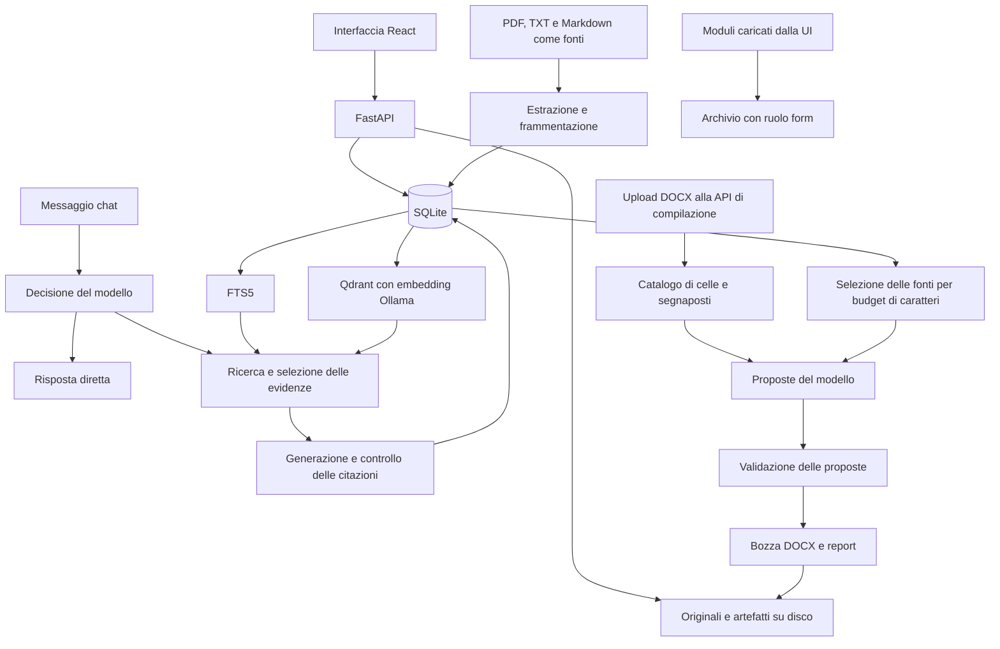

# Mappa e audit di Mapi RAG

Verifica del 3 ottobre 2026, sul codice del repository e sulle fixture versionate.
Punto di partenza: commit `6307952`. Le correzioni dell'audit sono conservate nel
commit `2e4e946`; la compilazione è stata poi semplificata a un unico percorso.

La base è utilizzabile per il prototipo, con una suite di regressione ampia e
buone separazioni fra originali, fonti e documenti generati. Non era però priva
di difetti: l'audit ha riprodotto problemi nella navigazione della chat, nella
validazione delle email, nel salvataggio degli artefatti e nel replay delle prove.
Questi punti sono stati corretti. La compilazione iterativa attraverso la chat
rimane una funzionalità da progettare e implementare.

## Struttura del repository

| Percorso | Responsabilità |
|---|---|
| `backend/app/` | 30 moduli Python, incluso `__init__.py`: API, persistenza, AI, retrieval, compilazione. Circa 8.800 righe prima degli interventi. |
| `backend/tests/` | Regressioni API e di dominio, provider simulati, fixture DOCX reali, Qdrant locale con embedding simulati. |
| `backend/scripts/` | Cinque strumenti per creare progetti/fixture, eseguire compilazioni dimostrative e ripetere prove registrate. |
| `frontend/src/` | React e TypeScript: pagine, componenti, hook, client API, tipi, CSS e test. |
| `frontend/e2e/` | Dieci file di scenari Playwright e una fixture JSON; progetti desktop e mobile. |
| `demo-documents/` | 27 file versionati: bandi, moduli, fonti aziendali simulate e conoscenza tecnica. Input di test e script, da conservare. |
| `backend/data/` | Database, originali, artefatti e risultati locali; escluso da Git. |
| `.tools/`, `.uv-cache/`, `.npm-cache/`, altre cache | Strumenti e cache locali; non sono codice applicativo. |
| `start.sh` | Avvio coordinato di Uvicorn e Vite in sviluppo, porte configurabili, arresto dei processi. |
| `README.md`, `LICENSE`, `.gitignore` | Istruzioni operative, licenza e confini dei file versionati. |

Python e dipendenze sono dichiarati in `backend/pyproject.toml` e bloccati in
`backend/uv.lock`; le dipendenze JavaScript in `frontend/package.json` e
`frontend/package-lock.json`. La build frontend esegue TypeScript e poi Vite.
Il backend viene eseguito da Python: non ha un passaggio di compilazione analogo.

## Percorsi dei dati



L'archivio `form` non è ancora collegato al motore di compilazione: l'API DOCX
richiede un nuovo upload. Il retrieval della chat non alimenta il contesto DOCX.
La generazione Markdown costituisce un terzo percorso, distinto da chat e DOCX.

## Backend: responsabilità dei moduli

Tutti i percorsi della tabella sono relativi a [backend/app](../backend/app).

| Modulo | Responsabilità e collegamenti |
|---|---|
| `main.py` | Applicazione FastAPI, inizializzazione, CORS, 28 operazioni HTTP, orchestrazione chat, upload fonti, artefatti e bozze Markdown. Registra quattro router. |
| `db.py` | Percorsi dati, connessioni SQLite, schema, migrazioni compatibili con installazioni precedenti, trigger FTS e timestamp dei progetti. |
| `repository.py` | CRUD e query, conversazioni, fonti globali/progetto, ricerca lessicale, selezione dei vicini, ricaricamento delle evidenze e metriche. |
| `schemas.py` | Contratti Pydantic di richieste e risposte pubbliche. |
| `seed.py` | Inizializzazione una tantum dei progetti e dei dati dimostrativi. |
| `ingestion.py` | Limite upload 20 MB, estrazione PDF/testo, frammenti da circa 1.200 caratteri con sovrapposizione di 200. |
| `artifacts.py` | File Markdown, hash, versioni, legami al progetto, reindicizzazione, migrazione dei vecchi artefatti. |
| `call_facts.py` | Lettura/scrittura dei fatti estratti, provenienza, revisione e stati dei fatti. |
| `fact_extraction.py` | Selezione delle fonti, richiesta AI e validazione dell'estrazione dei fatti del bando. |
| `draft_generation.py` | Generazione Markdown da template, fonti aziendali, dati di progetto e fatti; controlli sui riferimenti ai fatti. |
| `intents.py` | Decisione strutturata della chat: risposta diretta oppure una–tre query, con un tentativo di correzione. |
| `generation.py` | Contratto delle risposte, timeout, gestione del troncamento, citazioni e conteggio token. |
| `retrieval.py` | Interfaccia LangChain comune a FTS5/Qdrant, fusione dei risultati e ampliamento del contesto. |
| `retrieval_documents.py` | Conversione fra evidenze applicative e `Document` LangChain. |
| `retrieval_settings.py` | Configurazione del retrieval, segreti cifrati e lock dell'indice locale. |
| `retrieval_routes.py` | Quattro operazioni HTTP: lettura/salvataggio impostazioni, verifica connessione e indicizzazione. |
| `retrieval_embeddings.py` | Adapter Ollama con divieto di troncamento degli input, controlli sui vettori e sull'identità del modello. |
| `vector_retrieval.py` | Corpus SQLite, sincronizzazione Qdrant per hash, filtri per progetto, rilettura dei risultati dalla fonte corrente. |
| `project_forms.py` | Quattro operazioni HTTP per upload, elenco, download e rimozione di originali DOCX/PDF/TXT/MD; nessuna indicizzazione dei moduli. |
| `docx_templates.py` | Validazione del contenitore DOCX, scoperta delle posizioni scrivibili, riconoscimento dei campi protetti e scrittura dall'originale. |
| `document_compilation.py` | Catalogo fonti, prompt, proposte strutturate, validazione e report. Una sola chiamata per tutto il documento, senza gruppi o correzioni automatiche. |
| `document_compilation_routes.py` | Quattro operazioni HTTP per creazione/elenco/dettaglio/download delle compilazioni; conserva originale, bozza e report. |
| `config.py` | Impostazioni AI e `ContextVar` per mantenere provider e modello durante un'operazione; importazione della configurazione ambiente preesistente. |
| `ai_providers.py` | Catalogo provider, protocolli, metadati per la UI e header di autenticazione. |
| `ai_profiles.py` | CRUD profili, selezione per progetto, cifratura delle chiavi e importazione della configurazione precedente. |
| `ai_transport.py` | Adapter dei protocolli AI; normalizza risposte, token e ragioni di arresto. Supporta schema JSON nativo su Ollama. |
| `ai_discovery.py` | Recupero dell'elenco modelli dal servizio configurato. |
| `ai_login.py` | Collegamento OpenRouter con PKCE e credenziali temporanee sul server. |
| `ai_routes.py` | Dieci operazioni HTTP per profili, login, selezione e verifica; errori di validazione privati senza ripetere i segreti inviati. |
| `__init__.py` | Inizializzazione del package. |

[backend/main.py](../backend/main.py) riesporta l'app come entry point compatibile;
`start.sh` usa invece `app.main:app`.

## API e persistenza

Sono dichiarate **50 operazioni HTTP applicative**, oltre alle route generate
da FastAPI per la documentazione.

| Prefisso o risorsa | Operazioni |
|---|---|
| `/api/health` | Stato del processo. |
| `/api/projects` e `/{project_id}` | Elenco, creazione, dettaglio, rinomina, eliminazione. |
| `/api/global-knowledge` e `/files` | Fonti globali, caricamento, rimozione e modifica testuale. |
| `/api/projects/{id}/files` | Fonti di progetto, caricamento, rimozione e modifica testuale. |
| `/api/projects/{id}/global-knowledge` | API conservata per l'accesso alle fonti globali; oggi sono condivise con tutti i progetti. |
| `/api/projects/{id}/artifacts` | Lettura e modifica degli artefatti Markdown. |
| `/api/projects/{id}/call-facts` | Estrazione, lettura e revisione dei fatti. |
| `/api/projects/{id}/draft/generate` | Bozza Markdown. |
| `/api/projects/{id}/answer`, `/evidence`, `/conversations/{conversation_id}` | Chat, ricerca esplicita e cronologia. |
| `/api/projects/{id}/forms` | Archivio degli originali da compilare. |
| `/api/projects/{id}/document-compilations` | Generazione DOCX e accesso ai risultati precedenti. |
| `/api/projects/{id}/document-review` | Vista dei campi dimostrativi. |
| `/api/settings/ai`, `/api/projects/{id}/ai-model` | Connessioni e selezione del modello. |
| `/api/settings/retrieval` | Configurazione e manutenzione del retrieval. |

Lo schema comprende 18 tabelle ordinarie e due tabelle virtuali FTS5:

| Gruppo | Tabelle |
|---|---|
| Progetti | `projects`, `project_files`, `knowledge_sources` |
| Fonti e indice | `document_chunks`, `document_chunks_fts`, `global_documents`, `global_document_chunks`, `global_document_chunks_fts`, `project_global_document_links` |
| Conversazioni | `conversations`, `conversation_turns` |
| Artefatti e risultati | `knowledge_artifacts`, `project_artifact_links`, `document_fields`, `document_compilations` |
| Configurazione | `app_metadata`, `ai_profiles`, `ai_preferences`, `ai_login_flows`, `project_ai_settings` |

`project_files.kind` distingue fonti, moduli e contenitori degli artefatti; esiste
anche il ruolo storico `template`. Template e output generati sono esclusi dalle
evidenze fattuali. Le fonti globali sono condivise; le fonti degli altri progetti
non vengono incluse nella ricerca del progetto corrente. Gli ID negativi delle
evidenze globali evitano collisioni con quelli delle evidenze di progetto.

I DOCX generati conservano hash di originale e output, provenienza e report di
validazione. Non esiste ancora uno stato persistente di compilazione modificabile
e riprendibile: i record attuali descrivono risultati conclusi.

## Frontend

| File o gruppo | Funzione |
|---|---|
| `src/main.tsx`, `src/App.tsx` | Bootstrap React, router e associazione delle pagine agli URL. |
| `pages/ProjectsPage.tsx` | Elenco, ricerca, ordinamento e creazione dei progetti. |
| `pages/ProjectWorkspacePage.tsx` | Chat, cronologia, evidenze, rinomina/rimozione progetto e pannello documenti. |
| `components/ProjectKnowledgePanel.tsx` | Caricamento e modifica delle fonti testuali, rimozione fonti. |
| `components/ProjectFormsPanel.tsx` | Caricamenti multipli, download originali e rimozione moduli. |
| `pages/CompanyKnowledgePage.tsx` | Gestione delle fonti globali aziendali e tecniche. |
| `pages/GeneralSettingsPage.tsx`, `components/AiSettingsPanel.tsx`, `components/RetrievalSettingsPanel.tsx` | Configurazione AI e ricerca. |
| `components/ProjectModelSelector.tsx` | Selezione del modello dal compositore della chat. |
| `pages/DocumentReviewPage.tsx` | Revisione dimostrativa in sola lettura; non è l'editor del DOCX generato. |
| `pages/CandidatureDemoPage.tsx`, `pages/candidatureDemo.ts` | Demo concettuale autonoma: dati fittizi, file non elaborati, esportazione HTML. |
| `pages/KnowledgeArtifactsPage.tsx` | Redirect per vecchi segnalibri alla pagina del progetto. |
| `components/AppShell.tsx`, `LoadingState.tsx`, `StatusPill.tsx` | Navigazione e componenti condivisi. |
| `hooks/useProject.ts`, `hooks/useDismissibleMenu.ts` | Caricamento del progetto e gestione dei menu. |
| `api.ts`, `types.ts`, `sourceText.ts` | Trasporto HTTP, contratti TypeScript, nomi dei file e descrizione dei frammenti. |
| `App.css`, `index.css`, CSS dei componenti/pagine | Stili globali e delle aree funzionali. |
| `*.test.ts(x)`, `test/setup.ts` | Test Vitest/Testing Library. |

Gli URL principali sono `/projects`, `/projects/:id`,
`/projects/:id/conversations/:conversationId`, `/company-knowledge`, `/settings`,
`/projects/:id/review` e `/demo/candidatura`. `/projects/:id/knowledge` è un redirect.

## Script e fixture

| Script | Uso e stato |
|---|---|
| `create_tender_projects.py` | Crea i progetti di studio Catanzaro/Minervino nel database configurato. |
| `create_paragraph_template.py` | Genera una fixture DOCX con tabelle e segnaposti; non sovrascrive file esistenti. |
| `compile_docx_demo.py` | Prova end-to-end con database temporaneo e documenti simulati; `--live` abilita le chiamate AI. |
| `compile_docx_ollama.py` | Prova con il profilo Ollama salvato nel progetto; può salvare il risultato se richiesto. |
| `replay_docx_audit.py` | Ripete una compilazione su template e fonti congelati, inoltrando le opzioni al provider. Legge `request-01.prompt.json` e il nome storico `batch-01.prompt.json`; esegue sempre una chiamata unica. Non supporta tutti i formati degli altri script. |

`demo-documents/bandi/` contiene Catanzaro, Minervino e Trapani; `general-kb/`
contiene la conoscenza tecnica. La visura e le generalità aziendali sono simulate.
La mappa campi di Catanzaro serve alle prove: il motore applicativo non la usa per
codificare risposte specifiche del bando.

## Codice morto e compatibilità

**Rimosso:** `react-markdown`, `remark-frontmatter` e `remark-gfm`. Nessun import
applicativo li utilizzava. La rimozione elimina 103 voci del grafo dei pacchetti
installati/bloccati, senza aggiungerne altre. Il bundle già non li utilizzava:
questo intervento alleggerisce le dipendenze, non dimostra un guadagno di velocità
durante l'uso della pagina.

**Client frontend senza utilizzatori applicativi:** nove metodi in `api.ts`:
`projectArtifacts`, `projectArtifact`, `updateProjectArtifact`, `generateDraft`,
`documentCompilations`, `documentCompilation`, `compileDocument`,
`downloadCompilation`, `projectEvidence`. Alcuni compaiono soltanto nei test.
Sono residui della UI rimossa; restano inventariati perché le API backend
corrispondenti esistono e il lavoro successivo sulla compilazione può riusarli.
I tipi raggiunti soltanto da questi metodi seguono lo stesso stato.

**Da conservare:** il motore DOCX è raggiungibile da API e script. La modalità a
gruppi da 32 è stata rimossa insieme alla divisione delle risposte troncate e ai
tentativi automatici di correzione; i test dei controlli sui valori restano attivi.
Le API Markdown sono ancora esposte. La demo e la revisione hanno route attive. Il
redirect e la migrazione dei template legacy gestiscono compatibilità reale.
La mancanza di una voce visibile nel menu non prova che questi moduli siano morti.

La ricerca dei riferimenti non ha trovato funzioni top-level Python prive di
riferimenti tra applicazione e script dopo aver escluso gli entry point
decorati. È un controllo statico orientativo, non una prova di raggiungibilità
di ogni ramo. Non è stata misurata la copertura dei selettori CSS nel browser.

## Problemi riprodotti e interventi

| Priorità | Difetto osservato | Intervento e prova |
|---|---|---|
| Alta | Una risposta chat tardiva poteva riaprire il progetto/conversazione lasciato; un errore tardivo poteva contaminare il nuovo turno e sbloccare un'altra richiesta. | Annullamento della richiesta e controllo dell'identità dell'operazione. Quattro test comprendono cambio progetto, cambio conversazione, errore e percorso normale. Prima della correzione tre fallivano. |
| Alta | Una citazione abbreviata poteva nascondere parti di un indirizzo email e autorizzare la scrittura di un recapito diverso. | Verifica dei confini nell'intera fonte, all'interno del passaggio citato. Quattro regressioni fallivano prima della correzione; coperto anche il caso valido con spazi/punteggiatura. |
| Alta | Un errore SQL o di indicizzazione poteva lasciare l'artefatto modificato con hash/versione/indice precedenti. | Transazione di scrittura prima della lettura, sostituzione del file dopo l'indicizzazione e ripristino dei byte se il commit fallisce. File temporanei univoci e ripuliti. Quattro prove di guasto coprono metadati, indice, commit e sostituzione file. |
| Media | Il replay non inoltrava `max_tokens`/`timeout_seconds` e cercava il template solo nella vecchia cartella. | Opzioni inoltrate e supporto per layout corrente e storico, con due prove complete senza provider reale. |

Inoltre sono stati abilitati i controlli TypeScript `strict` per applicazione e
configurazione Vite. Il codice esistente li superava già. Ollama riceve ora anche
per il DOCX lo schema JSON di `ModelProposals`, derivato dal validatore effettivo.
La versione del prompt è ora `docx-fields-v14-whole-document`: tutte le posizioni
candidate del DOCX appartengono alla stessa richiesta. I nuovi report usano lo
schema 4 e descrivono l'esecuzione con `strategy`, `candidate_count` e `requests`,
senza contatori di gruppi o correzioni. I report già salvati restano consultabili
e scaricabili nella forma originale.

Annullare la richiesta browser impedisce effetti tardivi sulla UI; non garantisce
che il provider o il server interrompano una generazione già iniziata. Il ripristino
degli artefatti copre le eccezioni provate, non rende file e SQLite una transazione
unica resistente a un arresto improvviso del processo o del sistema.

## Questioni aperte

| Priorità | Punto | Implicazione |
|---|---|---|
| Alta per la nuova compilazione | Nessuno stato riprendibile, nessun collegamento chat → moduli, nessuna gestione delle correzioni utente. | Non basta riattivare il vecchio pulsante per ottenere una compilazione iterativa. |
| Alta per affidabilità dei dati | Controlli prevalentemente sintattici e letterali. | Un valore autentico può essere assegnato al soggetto/sezione sbagliati; una citazione valida non prova l'affermazione. |
| Media | Il DOCX seleziona fonti distribuite per budget: 40.000 caratteri aziendali, 90.000 di progetto e 20.000 generali. | Non ricerca le fonti necessarie a ogni campo. I budget in caratteri non sono adattati alla finestra token del modello. |
| Media | Chiamata unica DOCX con limite di 1.800 secondi e 32.768 token in uscita, senza job persistente. | Una richiesta lunga non può essere ripresa dalla UI dopo una disconnessione; manca una misura reale del contesto necessario per modello/modulo. |
| Media | `repository.py`, `main.py` e `document_compilation.py` concentrano molte responsabilità. | Separare routing/orchestrazione, persistenza e validatori durante gli interventi funzionali; evitare una riscrittura generale solo per ridurre le righe. |
| Media | `_finish_ingestion` estrae PDF e suddivide il testo sincronicamente dentro una funzione async. | Un PDF impegnativo può occupare l'event loop; da spostare in un worker/thread con limiti espliciti. È una valutazione del percorso, non un benchmark di carico. |
| Media | File caricati come fonti vengono scritti prima dell'inserimento nel database; la compensazione non copre ogni errore successivo. | Possibili file orfani su errore di persistenza. Da uniformare al salvataggio dei moduli. |
| Media | Qdrant riconcilia l'intero corpus prima di ogni ricerca e serializza il lavoro con un lock. | Adeguato al corpus del prototipo; costo e contesa crescono con documenti e utenti. Non misurati sotto carico. |
| Media | Nessuna autenticazione applicativa; `start.sh` ascolta su `0.0.0.0`. | Il modello di utilizzo attuale è locale/rete fidata; un accesso condiviso richiederebbe una decisione esplicita su identità e autorizzazioni. |
| Bassa | Creazione progetto nel frontend senza gestione esplicita del rifiuto della richiesta e senza blocco di invii ripetuti. | Un errore API non viene presentato nel modulo di creazione; da correggere nel prossimo intervento sulla pagina. |
| Bassa | Nessuna pipeline CI versionata; E2E misti fra API simulate e backend reale. | Le verifiche dipendono dai comandi locali; conviene separare i gruppi di test e automatizzare quelli isolati. |

La suite non misura una percentuale di accuratezza del modello. Le prove con
provider simulati verificano il software; una valutazione semantica richiede
risposte reali e campi attesi annotati.

## Passo successivo per la compilazione

Per un ciclo con chiarimenti, la prima unità di lavoro dovrebbe essere un solo
DOCX già archiviato, una sezione ambigua e una risposta dell'utente:

1. Collegare una sessione al `form_id` e all'hash dell'originale, verificando progetto e formato.
2. Conservare mappa dei campi, proposte, fonti, problemi aperti e versioni della sessione.
3. Separare informazioni da cercare nelle fonti e scelte da chiedere all'utente.
4. Cercare evidenze mirate per i campi irrisolti, con budget e condizioni di arresto.
5. Registrare le correzioni come dati dell'utente e preservarle nei passaggi successivi.
6. Rigenerare ogni versione dall'originale e dallo stato; non reinterpretare una bozza come template.
7. Esporre stato, chiarimenti, report e download nella chat, misurando errori di soggetto/posizione oltre ai campi riempiti.

Parser, validatori, writer DOCX, profili AI e retrieval sono riutilizzabili.
La scelta fra avviare questa integrazione o valutare prima il solo motore DOCX
resta aperta. In questo audit sono stati implementati miglioramenti circoscritti
al motore e alle basi applicative, non il nuovo workflow.

## Verifiche

Il punto di partenza superava 659 test backend e 57 test frontend, Ruff, Oxlint e
build Vite. I nuovi test hanno esposto difetti che non erano coperti dalla suite.

| Verifica al termine dell'audit | Esito |
|---|---|
| Pytest backend | 671 test superati. |
| Vitest frontend | 61 test superati, in 11 file. |
| Playwright selezionato | 10 test superati, su desktop e mobile. |
| Ruff e Oxlint | Nessun errore. |
| TypeScript strict e build Vite | Completati. |
| `bash -n start.sh`, `./start.sh --help` | Completati. |
| `git diff --check` | Nessun errore di whitespace. |

Nessuna chiamata reale ai provider è stata necessaria per questi test.

Dopo la rimozione della modalità a gruppi, l'intera suite backend supera
637 test. Sono stati rimossi i casi dedicati al comportamento abbandonato e
conservate le verifiche sui valori, aggiungendo controlli sul percorso unico e
sull'accesso ai report storici. I moduli Catanzaro e Minervino inviano tutti i
279 e 254 candidati in una sola richiesta nelle prove con provider simulato.
Ruff, Oxlint, TypeScript strict e build Vite passano anche dopo la semplificazione.
Queste prove verificano il percorso software; non misurano la qualità delle
proposte prodotte da un modello reale.

```bash
cd backend
uv run --locked pytest -q
uv run --locked ruff check .
cd ../frontend
npm test
npm run lint
npm run build
# Con Vite avviato su una porta dedicata:
PLAYWRIGHT_BASE_URL=http://127.0.0.1:5179 npm run test:e2e -- \
  e2e/composer-model-menu.spec.ts e2e/document-review.spec.ts e2e/project-forms.spec.ts
```

Le verifiche API usano database/cartelle temporanei. I dieci scenari browser
selezionati usano API simulate su desktop/mobile. Gli altri E2E e i benchmark con
modelli reali non fanno parte di questa esecuzione.
